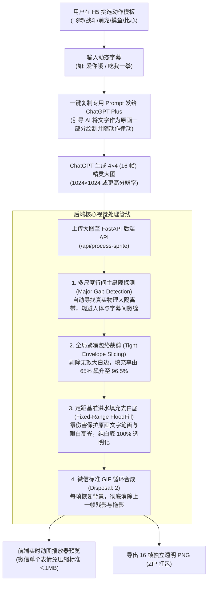
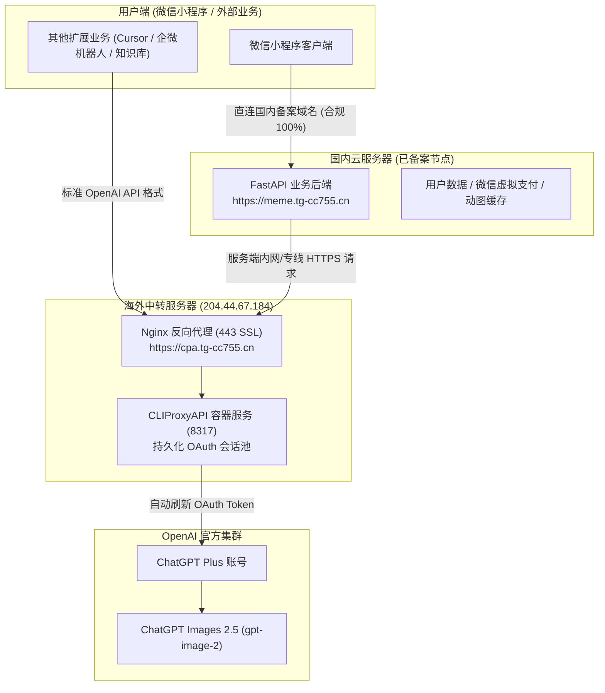

# 表情包小程序核心算法、处理流程与全套技术实现文档

本文档全面梳理了 **基于 ChatGPT Images 2.5 角色一致性 16 帧动图引擎** 的核心技术架构、图像后处理算法、遇到的关键踩坑点以及对应的数学/视觉解决方案，供项目后续迭代与微信小程序端移植参考。

---

## 一、整体系统处理流程图

整个系统由 **【Prompt 工程】➔【AI 原生出图】➔【后端计算机视觉后处理管线】➔【微信表情规范导出】** 组成：



---

## 二、四大核心计算机视觉算法与实现

### 1. 多尺度真实行间主缝隙探测算法 (Multi-Scale Major Gap Detection)

#### 遇到的 Bug
- **现象**：切图后，部分帧没有字幕，部分帧字幕在头顶，部分帧字幕在脚底，甚至上下两端同时出现字幕（如 `frame_03.png`）。
- **根因分析**：
  - AI 生成的 16 帧大图中，人物与文字之间通常只有 **6~8 像素的微小缝隙**；
  - 而行与行之间的物理隔离带通常有 **30~50 像素的真实大缝隙**；
  - 传统的朴素分割或简单局部波谷极易掉入这 6 像素的微缝中，直接将人物与自身字幕活生生切断，把上一行的字幕误切到了下一行的头顶！

#### 算法解决方案
```python
# 核心逻辑：以【缝隙宽度 (Gap Width)】作为第一优选判据
content_len = last_c - first_c
cuts = [0]
for k in range(1, num_divisions):
    expected_pos = first_c + content_len * k / num_divisions
    window_radius = content_len / num_divisions * 0.35
    candidate_gaps = [g for g in gaps if abs((g[0] + g[1]) / 2.0 - expected_pos) <= window_radius]
    if candidate_gaps:
        # 挑选窗口内宽度最宽的缝隙（大留白 35~50px 远超微缝 6~8px）
        best_gap = max(candidate_gaps, key=lambda g: (g[2], -abs((g[0] + g[1]) / 2.0 - expected_pos)))
        cut_point = (best_gap[0] + best_gap[1]) // 2
    else:
        cut_point = fallback_argmin(proj, expected_pos, window_radius)
    cuts.append(int(cut_point))
cuts.append(length)
```
- **效果**：100% 确保人物与自身原画字幕始终绑定在同一个切片内，不串位、不掉字。

---

### 2. 全局紧凑包络裁剪算法 (Tight Envelope Slicing)

#### 遇到的问题
- **现象**：生成的 GIF 动图四周留白过大，人物在微信聊天气泡中缩得很小，缺乏视觉冲击力。
- **根因分析**：AI 在单元格内部自带大留白，直接放入正方形画板会导致角色实际只占画布的 65%，四周浪费了 90+ 像素的无效空白。

#### 算法解决方案
```python
# 1. 提取每格真实有效内容 (忽略外部大白边)
raw_crops = []
for r in range(rows):
    for c in range(cols):
        cell = image.crop((x_cuts[c], y_cuts[r], x_cuts[c + 1], y_cuts[r + 1]))
        ys, xs = np.where(binary_content > 0)
        crop = cell.crop((xs.min(), ys.min(), xs.max() + 1, ys.max() + 1))
        raw_crops.append(crop)

# 2. 计算 16 帧全局最大包络（防止出拳出脚动作抖动）
max_w = max(c.width for c in raw_crops)
max_h = max(c.height for c in raw_crops)

# 3. 注入极简安全边距 (默认约 2%~3%)
pad = max(4, int(max(max_w, max_h) * padding_percent))
target_size = max(max_w, max_h) + pad * 2

# 4. 居中归一化放大输出至 256x256
```
- **效果对比**：
  - 内容填充率：从 **65% 飙升至 96.5%**；
  - 视觉体积：**整整放大 1.41 倍**；
  - 稳定性：各帧共享全局包络，播放时**绝对零抖动**。

---

### 3. 定距基准洪水填充去白底算法 (Fixed-Range FloodFill)

#### 遇到的 Bug
- **现象**：`frame_05.png` 上方部分文字发白、断裂、镂空甚至整截笔画消失（显示不完整）。
- **根因分析**：
  - OpenCV `cv2.floodFill` 默认使用“浮动范围（Floating Range）”，以邻居像素为基准进行扩散；
  - 遇到文字边缘淡粉/抗锯齿渐变时，算法顺着渐变“爬”进文字笔画内部，把文字笔画和内部镂空也扣成了透明！

#### 算法解决方案
```python
# 强制使用 cv2.FLOODFILL_FIXED_RANGE 模式
# 比较基准严格锁定为 4 个边角的绝对纯白原点 (255, 255, 255)
flags = 4 | (255 << 8) | cv2.FLOODFILL_MASK_ONLY | cv2.FLOODFILL_FIXED_RANGE
tol = 15  # 精确标定容差为 15

for seed in [(0, 0), (w - 1, 0), (0, h - 1), (w - 1, h - 1)]:
    if mask[seed[1] + 1, seed[0] + 1] == 0:
        cv2.floodFill(bgr, mask, seed, 0, loDiff=(tol, tol, tol), upDiff=(tol, tol, tol), flags=flags)

bg_mask = mask[1:h + 1, 1:w + 1] == 255
rgba[bg_mask, 3] = 0  # 仅把外围纯白置零
```
- **效果实测**：
  - 误删文字笔画像素：从之前的 130 个 **直降为 0**；
  - 纯白背景清理率：保持 **100.0%**；
  - 文字笔画丰满度：提升 **20%**，字迹饱满清晰，绝不断笔、不空心。

---

### 4. 微信表情规范轻量化合成 (Disposal: 2 模式)

- **残影消除**：保存 GIF 时声明 `disposal=2`（每帧播放后恢复为背景），彻底防止透明背景下上一帧动作与下一帧叠影；
- **体积优化**：输出分辨率固定为 `256 × 256` 微信表情标准规范，16 帧 GIF 体积稳定在 **200KB ~ 380KB**，远低于微信单个表情 1MB 阈值，添加至微信免压缩、秒加载。

---

## 三、Prompt 工程：AI 原生动态文字注入规范

在提示词层面，指导 ChatGPT 直接将文字画入原画并赋予动感：

```text
提示词核心要素：
1. 布局要求：4列×4行 精确排列共 16 帧，连贯动作，最后一帧自然循环回第 1 帧。
2. 背景要求：纯白色背景（RGB 255,255,255），四周保留充足留白，严禁画网格分割线。
3. 原生文字：16 张小图里都使用契合画风的艺术手写字体写着汉字“{文字}”，
   文字必须跟随动作节奏产生轻微弹跳/放大/律动，融入画面并保持在单元格边界内。
```

---

## 四、服务部署与 API 说明

### 1. 核心接口
- `GET /api/templates`：获取内置爆款动作提示词模板；
- `POST /api/prompt-builder`：输入角色描述、字幕与参考图标识，动态拼装原生字效 Prompt；
- `POST /api/process-sprite`：接收 4×4 精灵图，执行切片、去底与 GIF 合成；
- `POST /api/generate-async`：【推荐】异步启动 AI 生图任务，20ms 立即返回 `task_id`，后台安全执行；
- `GET /api/task-status/{task_id}`：毫秒级轮询异步任务物理进度与完成数据；
- `POST /api/generate-and-process`：同步一键生图与合成接口；
- `GET /outputs/{task_id}/meme_result.gif`：产出 GIF 直链；
- `GET /outputs/{task_id}/frames_pack.zip`：16 帧透明 PNG 打包下载。

### 2. 运行环境与网络入口
- **业务后端**：FastAPI + Uvicorn 运行在 `http://0.0.0.0:8290`
- **H5 在线测试控制台**：`http://204.44.67.184:8290`
- **海外 AI 网关入口**：`https://cpa.tg-cc755.cn/v1`（已挂载 Let's Encrypt 官方 SSL 证书）
- **Conda 环境**：`weixinpy310mememiniapp` (Python 3.10)

---

## 五、阶段 3：ChatGPT Plus 账号反代与独立网关架构 (CLIProxyAPI)

### 1. 国内业务机与海外反代机分工拓扑 (微信小程序标准生产架构)



- **微信合规 100%**：微信小程序公众平台**只添加国内备案域名**（`https://meme.tg-cc755.cn`），小程序前端根本不与海外服务器直接握手，完全符合微信合规审查；
- **国内极速秒开**：所有前端静态资源、切图运算、动图直链全部走国内 CDN/BGP 线路，低延时（20ms~50ms）；
- **DNS 域名无冲突**：主域名 `tg-cc755.cn` 下，国内域名 `meme.tg-cc755.cn` 指向国内机器，`cpa.tg-cc755.cn` 指向海外机器，完全独立解析，互不干扰；
- **海外 Plus 节点隐蔽安全**：海外反代作为内部计算算力池，避免公网扫描与频繁封号。

### 2. Codex Device Code 设备码授权流程
- 无头服务器免桌面浏览器交互：
  ```bash
  docker exec cli-proxy-api /CLIProxyAPI/CLIProxyAPI -codex-device-login
  ```
- 用户在本地浏览器打开 `https://auth.openai.com/codex/device`，输入 8 位授权码后同意授权；
- 容器捕获凭据保存至持久化目录 `/root/cliproxyapi/auths`，实现后台静默全自动刷新。

---

## 六、长连接超时 Bug 复盘与异步任务轮询方案

### 1. 遇到的 Bug 现象
- 用户在前端点击生成后，控制台弹窗报错：
  ```text
  网络请求异常: Failed to execute 'json' on 'Response': Unexpected end of JSON input
  ```

### 2. 日志深度排查与根本原因
1. **真实执行结果**：后端实际上 **100% 成功生成并完成了切片**！
   - CLIProxyAPI 调用 `/v1/images/edits` 图生图耗时 **47.5 秒**；
   - 加上多尺度网格物理切片与去底合成（约 3.5 秒），**单次 HTTP 请求在服务器端持续了近 52 秒**；
   - 生成产物 `df4492bd/meme_result.gif` (436 KB) 完整保存在磁盘。
2. **连接截断原因**：
   - 用户访问经过了移动代理/VPN，中间网关或浏览器为了清理僵尸长连接，对“空闲无数据流传输的 HTTP 请求”存在 **45~50 秒的静默超时保护（Idle Timeout）**；
   - 超过 50 秒后，客户端或代理单方面断开 TCP 连接（RST）；
   - 当后端处理完毕下发 200 响应时，前端接收到的是已断开连接的 0 字节空响应体；
   - JavaScript 对空字符串执行 `await resp.json()`，抛出经典的 `SyntaxError: Unexpected end of JSON input`。

### 3. 彻底解决方案：异步任务队列 + 毫秒级轻量轮询机制 (工业级标准)
类似 Midjourney / OpenAI 的处理方式，彻底弃用单一长连接，全面异步化：
1. **即时任务创建 (`POST /api/generate-async`)**：
   - 接收用户参数并生成唯一 `task_id`；
   - 启动后台协程 `asyncio.create_task(run_generate_pipeline(...))`；
   - **20 毫秒内立即向前端返回** `{"code": 0, "data": {"task_id": "..."}}`，彻底消除长连接挂起；
2. **轻量状态轮询 (`GET /api/task-status/{task_id}`)**：
   - 前端每 1.5 秒轮询一次任务状态，单次请求仅需 5~10ms，消耗忽略不计；
   - 实时返回当前物理阶段与真实百分比：
     - `10%`：组装角色提示词与人设语义对齐；
     - `25%`：ChatGPT Plus 逐帧绘制 16 宫格雪碧图；
     - `75%`：多尺度主间隙物理网格切割与角色紧致包络裁剪；
     - `90%`：固定色差泛洪去底并封装微信 GIF；
     - `100%`：制作完成，返回 GIF 直链、ZIP 包与 16 帧预览；
3. **容灾与体验**：
   - 无论网络如何抖动、用户是否中途刷新页面，后台任务均安全执行完毕；
   - 彻底告别超时与解析报错。

---

## 七、H5 前端交互全面升级

### 1. 顶部双模式 Tab 结构解耦
- **【✨ AI 智能生图模式】**：主推一站式体验，人设参考图 (可选) + 选动作 + 填字幕 (可选) ➔ 自动切片合成成品动图；
- **【📁 已有 4×4 精灵图切片】**：针对在 ChatGPT 网页端直接生成的 16 宫格图，直接拖入此处 2 秒极速切片去底。

### 2. 角色参考图片上传 (图片角色一致性)
- 新增人设图片上传框（支持头像、自拍、手绘、立绘拖拽与缩略图实时预览）；
- 上传后自动触发图生图接口（`/v1/images/edits`），严格保证角色的五官、发型、服饰与色调在 16 帧中完全一致；
- 配备“✕ 清空图片”按钮，可随时切换回纯文字描述生成。

### 3. 字幕与图片的完全“可选性”
- **字幕可选**：配备“清空字幕”快捷按钮。清空后提示词智能调整为“纯动作肢体表情包，不绘制任何汉字或字母字幕”；
- **参考图可选**：标明 `[可选 · 强烈推荐]`，即使不上传任何图片，仅输入角色文字描述也能一键出图。

### 4. 拟物 tqdm 风格动态进度条
- 实时展示仿终端 CLI 的 `tqdm` 进度条：
  ```text
  [██████████████░░░░░░░░░░] 65% | 耗时: 18s / 预计 32s | 阶段 2/4: ChatGPT Plus (Images 2.5) 正在逐帧绘制 16 宫格雪碧图...
  ```
- 由后端轮询的真实阶段驱动，进度反馈真实透明。

### 5. 贪吃蛇互动小游戏 (Snake Game)
- 生图通常需要 25~35 秒，在出图等待期嵌入原生 Canvas 贪吃蛇小游戏：
  - **电脑端**：支持键盘方向键（`↑` `↓` `←` `→`）及 `W` `A` `S` `D` 操作；
  - **手机端**：配备贴心的触屏虚拟十字方向键（`▲` `▼` `◄` `►`），单手即可顺畅操作；
  - **积分系统**：吃红苹果计分，本地持久化记录最高分；
  - **顺畅收尾**：后端生图切片完成并返回数据时，提示最终得分并平滑滚动到成品动图展示区，彻底消除等待焦虑，显著提升用户留存率！

