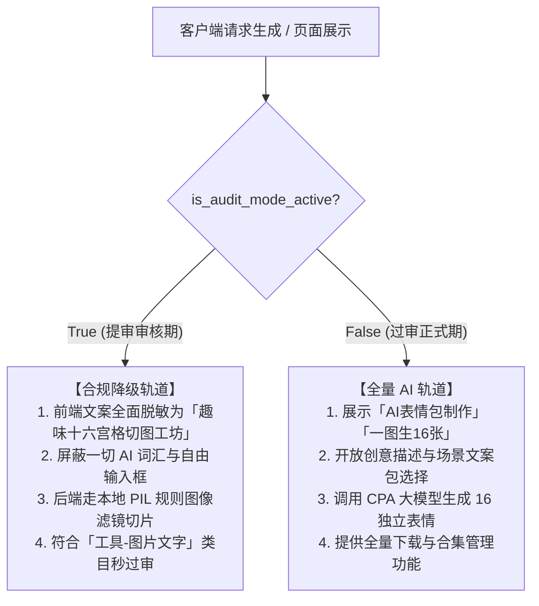

# 动态表情工坊 · 功能扩展计划

> 文档状态：**草稿 v1.4** ｜ 更新于 2026-09-21  
> 作者：个人开发者  
> 覆盖范围：图片百宝箱（remix）· 表情合集（collection）两个 Tab 的新增功能扩展与“一图变16张静态表情包”专项落地方案

---

## 目录

1. [现状梳理](#1-现状梳理)
2. [需求来源与借鉴策略](#2-需求来源与借鉴策略)
3. [变现策略与广告准入分析](#3-变现策略与广告准入分析)
4. [合规红线清单](#4-合规红线清单)
5. [需求拆解：图片百宝箱扩展](#5-需求拆解图片百宝箱扩展)
   - [R-NEW：一图生 16 张静态表情包（核心新功能 · 深度方案）](#r-new一图生-16-张静态表情包核心新功能--深度方案)
   - [5.1.1 对标参考设计拆解（基于实测5张截图）](#511-对标参考设计拆解基于实测5张截图)
   - [5.1.2 CPA模型图文解耦与场景文案模板包设计](#512-cpa模型图文解耦与场景文案模板包设计)
6. [微信个人主体审核双轨降级设计（规避AI资质死锁）](#6-微信个人主体审核双轨降级设计规避ai资质死锁)
7. [本地 Web 快速验证与调试控制台方案（FastAPI + H5）](#7-本地-web-快速验证与调试控制台方案fastapi--h5)
8. [需求拆解：表情合集扩展](#8-需求拆解表情合集扩展)
9. [内容安全审核流程](#9-内容安全审核流程)
10. [模块接口定义](#10-模块接口定义)
11. [R2 对象存储策略](#11-r2-对象存储策略)
12. [边缘测试用例](#12-边缘测试用例)
13. [顶层死锁规避设计](#13-顶层死锁规避设计)
14. [UI/UX 风格守则](#14-uiux-风格守则)
15. [实施优先级与里程碑](#15-实施优先级与里程碑)

---

## 1. 现状梳理

### 1.1 现有 Tab 结构

| Tab | 路由 | 核心功能 |
|-----|------|---------|
| 制作 | `pages/index/index` | AI 生成 16 帧 GIF 动图（上传照片/手绘） |
| 图片百宝箱 | `pages/remix/remix` | 去背景、多图合 GIF、长图拼接、格式转换等 |
| 表情合集 | `pages/collection/collection` | 我的合集 + 精选推荐展示 |
| 个人中心 | `pages/user/user` | 配额/订单/会员状态 |

### 1.2 已有后端能力（FastAPI · Python 3.10）

- `/api/meme/*` — AI 制图核心流水线
- `/api/collection/*` — 合集 CRUD（`col_official_` 前缀官方合集已受保护）
- `/api/convert/*` — 格式转换（去背/拼接/多图 GIF）
- `/api/check/*` — 文本 + 图片内容安全检测（已接入 `wx.msgSecCheck`）
- Cloudflare R2 已接入（`r2_storage.py`），支持按 artifact 名称过滤上传
- JWT 身份验证

### 1.3 现有内容安全检测覆盖点（`remix.js` 现状）

现有 remix 页已在以下时机调用 `app.checkImageSecurity / app.checkTextSecurity`：

- 选择图片后立即检测（去背、多图 GIF、长图拼接、卡片生成等全部分支）
- 输入文字 `bindblur` 时检测
- 视频封面缩略图检测

**新功能必须沿用相同检测节点**，不得绕过（见 §7）。

### 1.4 现有 R2 上传文件白名单

```
最终产物：meme_result.gif / compressed.gif / compressed.jpg / compressed.png
         card.png / matting_result.png / stitched.jpg
源文件：  input_sprite.png / original_image.png / original_image.jpg
```

---

## 2. 需求来源与借鉴策略

> **核心原则：去社交化、合规优先、个人开发者轻量实现。**  
> 只借鉴技术/数据接入逻辑，**不引入评论、关注、点赞、转发好友、排行榜等任何社区/社交功能**。

| 开源项目 | 可借鉴点 | 明确不引入的部分 |
|---------|---------|---------------|
| **zhaoolee/ChineseBQB** | 分类标签结构（主题包概念）、分页加载模式、图片 CDN 分发思路 | 社区评论、Star/Fork |
| **F-loat/ChineseBQB-weapp** | 2 列网格渲染、图片懒加载策略、搜索过滤 UI | 用户上传投稿、排行榜 |
| **xtyxtyx/sorry** | 模板 + 用户填词 → 静态图合成思路（文字气泡叠加） | GIF 录制（审核风险）、分享墙 |
| **xiaoshouchen/meme-mini-program** | 分类标签热词参考 | 关注/私信/社群、激励广告（见 §3） |
| **chenaild/mars_picture** | 头像/壁纸下载保存流程 | 壁纸板块（超出类目）、激励视频广告（见 §3） |

---

## 3. 变现策略与广告准入分析

### 3.1 微信流量主（激励视频广告）准入门槛

> **结论：当前阶段不接入激励视频广告，待条件满足后再启用。**

| 条件 | 要求 | 当前状态 |
|------|------|---------|
| 月活用户数 | ≥ 500 人 | ❌ 尚未达到 |
| 小程序注册时间 | ≥ 30 天 | 需确认 |
| 违规记录 | 无 | ✅ |

**提前接入的风险**：
- 申请开通流量主审核会失败，代码中写了广告单元 ID 也无法展示
- `wx.createRewardedVideoAd` 在未开通流量主时调用会静默失败，但代码复杂度增加
- 若将"看完广告才能保存"写入主流程，广告失效后用户体验直接崩溃

**当前替代变现策略（无门槛）**：

| 方案 | 说明 | 是否已有 |
|------|------|---------|
| 虚拟支付（道具/次数购买） | 用户购买生成次数配额，现有 `/api/payment/*` 已实现 | ✅ 已有 |
| 免费次数用完引导付费 | 配额归零时弹出付费引导卡片 | ✅ 已有 |
| 保存图片无门槛 | 直接保存，不设广告墙，提升用户留存和好感度，先积累 DAU | 🆕 保持现状 |

**广告预留设计（待条件满足后启用）**：

在代码结构上预留广告接入点，但通过 Feature Flag 默认关闭：

```javascript
// utils/adManager.js - 预留模块，默认 disabled
const AD_ENABLED = false; // 待流量主审核通过后改为 true，或由后端 app_settings 控制

export function tryShowRewardedAd(onAnyResult) {
  // 无论广告是否可用，最终都调用 onAnyResult（不卡用户）
  if (!AD_ENABLED) {
    onAnyResult();
    return;
  }
  // ... 广告逻辑（后续实现）
}
```

保存图片时调用 `tryShowRewardedAd(doSave)` — 广告关闭时等同于直接保存，代码路径一致，开启后无需改动调用方。

---

## 4. 合规红线清单

> 以下内容**一律不做**，任何功能设计不得触碰。

### 4.1 社交功能（被拒高危）

| 禁止项 | 原因 |
|--------|------|
| ❌ "分享给好友"按钮（结果图/合集） | 微信规范：工具类小程序不得诱导分享，个人开发者类目更严格 |
| ❌ 合集分享卡片生成（Canvas 合图转发） | 同上；Canvas 合图用于分享属于诱导分享 |
| ❌ 用户排行榜、热门榜单 | 社区属性，个人开发者类目不允许 |
| ❌ 评论/点赞/收藏他人作品 | 社交 UGC 功能 |
| ❌ "存入合集后可分享给好友"文案 | 文案暗示社交行为，需从现有代码中清理 |

> **现有代码待清理**：`remix.js` 第 1106 行 `"可在底栏【表情合集】或【个人中心】中查看与批量分享"` 和第 1332 行 `"可在底栏【表情合集】中查看或分享给微信好友"` — 实现阶段需将文案改为单纯的保存提示，去掉"分享"字样。

### 4.2 内容安全（违规高危）

| 禁止项 | 处理方式 |
|--------|---------|
| ❌ 政治敏感/暴恐内容素材 | 人工策展时过滤，上传前人工审核 |
| ❌ 用户绕过内容安全检测直接生成 | 所有文字输入必须经过 `wx.msgSecCheck`，图片必须经过 `wx.imgSecCheck` |
| ❌ 素材库中包含真人明星肖像（未授权） | 仅使用卡通/表情类图片，真人素材一律不入库 |
| ❌ 擦边/色情图片 | R2 上传脚本内置格式过滤，人工复核后才能上线 |

### 4.3 功能边界

| 禁止项 | 原因 |
|--------|------|
| ❌ 用户上传自定义素材到公共素材库 | 个人开发者无法做 UGC 内容审核，合规风险极高 |
| ❌ 壁纸/头像下载（mars_picture 模式） | 超出当前"工具-图片处理"类目 |
| ❌ GIF 模板录制并上传至服务器分享 | 审核风险，GIF 内容难以逐帧审核 |

---

## 5. 需求拆解：图片百宝箱扩展

### 5.1 功能清单（按优先级）

#### P0 — 必做（本次迭代）

| 编号 | 功能名 | 入口位置 | 描述 |
|------|--------|---------|------|
| **R-NEW** | **🆕 一图生 16 张静态表情包** | remix Tab 新子 Tab `sticker16` | 用户上传一张人像/宠物照 → 调用 CPA `images/edits` 生成 4×4 宫格雪碧图 → `SpriteProcessor.slice_grid` 切出 16 张静态 PNG → 用户可逐张预览并保存至相册；消耗 1 个生成配额 |
| R-01 | **素材库快速填图** | remix Tab 各模式"选图"入口 | 新增"从素材库选"来源，弹出分类图片选择器，选中后回填进当前 remix 模式的图片输入槽 |
| R-02 | **文字气泡叠加（单图文字贴纸）** | remix Tab 新子 Tab `text-sticker` | 用户选图 → Canvas 2D 叠加可拖动文字气泡 → 生成 PNG 保存至相册（纯静态图，规避 GIF 审核风险） |

#### P1 — 建议做（本次迭代或下次）

| 编号 | 功能名 | 入口位置 | 描述 |
|------|--------|---------|------|
| R-03 | **素材库本地缓存分页** | 素材库选择器内部 | 分类数据 JSON 首次加载后缓存 `wx.setStorageSync`，7 天过期；图片列表按页懒加载 |
| R-04 | **图片添加水印** | remix Tab 新子 Tab 或集成进 R-02 | 在图片右下角叠加固定水印文字（小程序名/自定义短语），纯前端 Canvas 实现 |

#### P2 — 观察后决策

| 编号 | 功能名 | 描述 | 风险 |
|------|--------|------|------|
| R-05 | **动态文字 GIF 模板** | sorry 式流程：选模板图 → 填词 → 后端 Pillow 合帧 → 返回 GIF | 审核风险：GIF 内容难以提前检测，先观察文字气泡的审核通过率再决策 |
| R-06 | **激励视频广告位** | 保存图片时植入激励广告 | 需等待流量主资格（月活 ≥ 500），预留代码接口，默认关闭 |

---

### R-NEW：一图生 16 张静态表情包（核心新功能 · 深度方案）

#### 5.1.1 对标参考设计拆解（基于实测 5 张截图）

根据对标产品（AI表情包小程序）的实测截图，我们将其核心商业与产品架构解构为 5 大闭环链路：

```
[首页主态 (截图2)]
    ├── 顶部 Banner："一张图 变出16张表情 聊天斗图 轻松拿捏全场"
    ├── 上传参考图组件（支持 jpg/png/gif 最大 10MB）
    ├── 创意描述输入框（"比如：更像头像原图、不要太幼稚、动作夸张一点"）
    ├── 次数配额看板（"当前剩余 X 次，生成 1 套消耗 1 次" ＋ [购买次数] 按钮）
    └── 底部悬浮栏：生成参数摘要胶囊 ＋ [立即生成 (消耗1次)]
           ↓ 点击参数摘要胶囊
[生成设置弹窗 (截图1)]
    ├── Tab 1: 【画面构图】
    │     ├── 画面风格：[跟随原图 (保留气质)] | [Q萌贴纸 (聊天可爱)] | [3D玩偶 (圆润公仔)]
    │     ├── 画面构图：[大头特写 (表情突出)] | [半身 (表情手势清楚)] | [全身 (动作完整)]
    │     └── 画面背景：[白色背景 (默认稳定)] | [透明底 (适合贴图与二次编辑)]
    └── Tab 2: 【文字设置】
          └── [无字纯表情] 或 [选择场景文字模板包]（打工人 / 斗图 / 萌萌 / 摆烂）
           ↓ 提交生成
[生成进度等待页 (截图3)]
    ├── 顶部步骤流：[准备] ➔ [识别] ➔ [生成] ➔ [整理]
    ├── 参考图展示与选定标签胶囊（如：跟随原图 · 半身 · 无字 · 白色背景）
    ├── 动态生成百分比进度条（25~35秒拟合）
    └── 【制作完成提醒】微信订阅消息卡片（"不用一直停在这里，完成后通知你来看结果" [通知我]）
           ↓ 完成回调
[16 宫格结果展示页 (截图4)]
    ├── 4×4 表情网格（16 张角色独立表情贴纸，支持单击勾选）
    ├── 第一操作栏：[↓ 保存整套 (16张到相册)] | [✓ 选中保存 (已选N张)]
    ├── 延伸玩法栏：[▷ 选中做GIF (单张变动图)] | [↑ 选中继续生成] | [🔄 16张连成动图]
    └── 底部操作栏：[再做一套] | [加入合集]
           ↓ 点击加入合集
[表情合集归档管理 (截图5)]
    └── 自动沉淀为合集包，支持批量管理、批量下载、改图与全屏幻灯浏览
```

---

#### 5.1.2 CPA 模型图文解耦与场景文案模板包设计

##### 痛点剖析：为什么不能让 AI 直接在图片上画汉字？
1. **字符乱码变形**：通用图像生成大模型（包括 DALL-E 3、Midjourney 等）在单张 1024×1024 图上同时生成 16 格时，对复杂汉字结构的渲染极易出现笔画缺漏、镜像字、错别字或火星文。
2. **文不对题**：AI 随机生成的文字可能与当前格子的表情动作不匹配（如哭脸配了“哈哈”）。
3. **无法独立编辑**：一旦文字固化在像素中，用户若想微调某个错字必须重新付费生成整套。

##### 解耦架构：AI 专注视觉表现 ＋ 规则引擎精准排版

```
┌─────────────────────────────────────────────────────────────┐
│  阶段 1：CPA 大模型专注渲染 (1024×1024 4×4 雪碧图)            │
│  · 输入：用户参考图 ＋ 精准 Prompt (定义16格特定情绪肢体)     │
│  · 约束：纯白底/透明底，纯角色面部神态与动作，绝不绘制文字!    │
└──────────────────────────────┬──────────────────────────────┘
                               │
                               ▼
┌─────────────────────────────────────────────────────────────┐
│  阶段 2：多尺度物理网格切割 (SpriteProcessor.slice_grid)     │
│  · 自动识别行间/列间主隔离带，切出 16 张 256×256 独立透明/白底帧 │
└──────────────────────────────┬──────────────────────────────┘
                               │
                               ▼
┌─────────────────────────────────────────────────────────────┐
│  阶段 3：规则排版引擎叠加文字 (Python Pillow / 前端 Canvas)   │
│  · 若用户选择【无字纯表情】：直接输出 16 张生动表情包贴纸     │
│  · 若用户选择【场景模板包】：根据格子序号精准匹配对应场景文案  │
│  · 排版规范：开源商用粗黑体、底部居中、黑边描边/黄色漫画字/气泡 │
│  · 结果：100% 准确无乱码、图文天生匹配、用户可随时修改文本    │
└─────────────────────────────────────────────────────────────┘
```

##### 4 大高频场景文案模板包与 16 种情绪映射表

通过预先设定 16 个固定索引位置的情绪与文案映射，确保每一张切片的**表情、手势与文案 100% 严丝合缝**：

| 格号 | 情绪 / 姿态定义 (AI Prompt 约束) | 套餐 A：【打工人日常】 | 套餐 B：【群聊斗图】 | 套餐 C：【萌系可爱回应】 | 套餐 D：【摆烂躺平】 |
|:---:|:---|:---|:---|:---|:---|
| **01** | 元气大笑，双手竖起大拇指 | 收到 / 好的老板 | 点赞 / 666 | 谢谢你 / 乖巧 | 好的(假装积极) |
| **02** | 俏皮眨眼，单手比耶 (V手势) | 这就去办 | 得瑟 / 拿捏 | 比心 / 么么哒 | 随缘吧 |
| **03** | 满头大汗，疯狂敲键盘 / 赶工 | 疯狂搬砖中 | 疯狂输出 | 加油鸭 | 我装的 |
| **04** | 悠闲托腮，手拿咖啡 / 水杯 | 摸鱼中... | 暗中观察 | 喝杯奶茶 | 坐看神仙打架 |
| **05** | 双手抱头，抓狂 / 头发凌乱 | 头秃了 / 改版中 | 崩溃 / 裂开 | 委屈巴巴 | 毁灭吧 |
| **06** | 嚎啕大哭，瀑布泪流满面 | 我太难了 | 哭死 / 扎心了 | 求抱抱 | 猛男落泪 |
| **07** | 怒火中烧，额头青筋 / 喷火 | 方案又改了?! | 出来挨打 | 生气气了哼 | 勿扰，已死 |
| **08** | 瞳孔地震，双手捂嘴极为震惊 | 纳尼?! / 震惊 | 惊呆了老铁 | 星星眼哇塞 | 还能这样? |
| **09** | 扶额叹气，一脸无奈白眼 | 血压上来了 | 无语子 / 翻白眼 | 叹气气 | 累了，退下吧 |
| **10** | 满脸问号，歪头抓耳朵疑惑 | 需求到底是什么? | 满头问号 | 疑惑脸?? | 听不懂也不想懂 |
| **11** | 戴酷墨镜，抱胸自信仰头 | 搞定，收工! | 帅气登场 / 绝了 | 酷酷的哦 | 佛系看淡 |
| **12** | 害羞红脸，手指轻轻戳脸颊 | 夸得我都不好意思了 | 害羞掩面 | 爱你哟 / 笔芯 | 算了吧 |
| **13** | 双手合十，眼巴巴诚恳拜托 | 跪求别催了 | 抱拳感谢大佬 | 拜托拜托啦 | 放过我吧 |
| **14** | 戴西瓜皮/手拿勺子，淡定看戏 | 吃瓜看戏 | 现场吃瓜 | 干杯耶 | 毫无波澜 |
| **15** | 打哈欠，双眼困顿冒鼻涕泡 | 困得灵魂出窍 | 睡了别艾特 | 呼呼大睡 | 躺平中... |
| **16** | 背起小书包，背影飞速狂奔 | 我下班啦溜了! | 告辞 / 溜了溜了 | 飞速奔向你 | 彻底告辞 |

用户亦可在生成前选择 **【自定义文字】**，在 16 个输入框中预填文字；或生成后点击单张图片进入已有“文字气泡叠加”功能进行二次修改。

---

#### 5.1.3 核心 Prompt 模板与参数组装规则

结合用户在设置弹窗中勾选的 **画面风格**、**画面构图**、**画面背景**，Prompt 组装函数动态构建高质量英语引导词：

```python
def build_sticker16_prompt(
    character_desc: str,
    style: str = "keep_orig",         # keep_orig | cute_chibi | 3d_toy
    composition: str = "bust",        # closeup | bust | full_body
    background: str = "white",        # white | transparent
    has_image: bool = True
) -> str:
    # 1. 风格定义
    style_prompts = {
        "keep_orig": "maintain original character identity, anime 2D flat avatar sticker style, consistent facial features",
        "cute_chibi": "chibi kawaii sticker style, super cute, big sparkling eyes, bold rounded sticker outline, pastel tones",
        "3d_toy": "3D cute vinyl toy figure style, PopMart blind box aesthetic, claymation feel, soft ambient occlusion lighting"
    }

    # 2. 构图定义
    comp_prompts = {
        "closeup": "extreme close-up headshots, large expressive faces occupying most of each cell",
        "bust": "bust portraits showing head, expressive hands and gestures clearly",
        "full_body": "full body dynamic poses, energetic and complete character silhouettes"
    }

    # 3. 背景定义
    bg_prompts = {
        "white": "solid clean white background (#FFFFFF), clean margins between cells",
        "transparent": "isolated transparent background cutout, crisp clean silhouette outlines"
    }

    # 4. 16 格固定动作与情绪指令（严禁包含任何文字）
    grid_actions = (
        "4x4 uniform grid layout consisting of 16 distinct square panels. "
        "Each cell MUST display a UNIQUE emotion/pose strictly in order: "
        "1. laughing with double thumbs up; 2. winking with peace V-sign; "
        "3. sweating typing furiously; 4. resting cheek drinking coffee; "
        "5. clutching head pulling hair in despair; 6. crying tears streaming; "
        "7. angry steaming face; 8. shocked hands on cheeks jaw-drop; "
        "9. sighing with slight eye-roll; 10. tilted head full of question marks; "
        "11. confident smile with sunglasses; 12. blushing shy cute grin; "
        "13. begging with hands clasped; 14. holding watermelon spoon eating; "
        "15. sleepy yawning bubble; 16. running away waving goodbye. "
    )

    base_prompt = (
        f"A master sticker sheet of {character_desc or 'the character in the reference'}. "
        f"{style_prompts.get(style, style_prompts['keep_orig'])}, "
        f"{comp_prompts.get(composition, comp_prompts['bust'])}, "
        f"{bg_prompts.get(background, bg_prompts['white'])}. "
        f"{grid_actions}"
        "NO letters, NO text, NO typography, NO watermark, NO borders inside cells, "
        "equal spacing between 4 rows and 4 columns, total resolution 1024x1024 pixels."
    )
    return base_prompt
```

---

#### 5.1.4 后端接口扩展规范

复用现有异步任务调度中心 `/api/generate-async`，增加以下 Form 表单参数：

```python
# POST /api/generate-async
参数扩展：
  output_mode: str = Form("gif")             # "gif" (原动图) | "sticker16" (16张静态贴纸)
  style_preset: str = Form("keep_orig")      # keep_orig | cute_chibi | 3d_toy
  composition_preset: str = Form("bust")     # closeup | bust | full_body
  bg_preset: str = Form("white")             # white | transparent
  text_package: str = Form("none")           # none (无字) | worker | battle | cute | slack | custom
  custom_texts: Optional[str] = Form(None)   # JSON 字符串，包含 16 个短语数组
```

**返回数据结构（`output_mode=sticker16`）**：
```json
{
  "code": 0,
  "data": {
    "task_id": "9f8a3c82d8104d2ab3e109823485ab12",
    "output_mode": "sticker16",
    "style_preset": "keep_orig",
    "composition_preset": "bust",
    "bg_preset": "white",
    "text_package": "worker",
    "frames": [
      {
        "index": 1,
        "url": "https://r2.tg-cc755.cn/tasks/9f8a.../frames/frame_01.png",
        "caption": "收到",
        "emotion": "大拇指点赞"
      },
      ...
      {
        "index": 16,
        "url": "https://r2.tg-cc755.cn/tasks/9f8a.../frames/frame_16.png",
        "caption": "我下班啦",
        "emotion": "奔跑挥手"
      }
    ],
    "zip_url": "https://r2.tg-cc755.cn/tasks/9f8a.../frames_pack.zip",
    "sprite_sheet_url": "https://r2.tg-cc755.cn/tasks/9f8a.../input_sprite.png",
    "stats": {
      "frame_count": 16,
      "duration_seconds": 26.8,
      "resolution": "256x256"
    }
  }
}
```

---

#### 5.1.5 前端页面与交互实现（remix Tab 新增子 Tab `sticker16`）

- **顶部 Banner**：沿用截图风格，深色渐变卡片 ＋ “一张图 变出16张表情 聊天斗图 轻松拿捏全场”
- **上传与参数摘要**：
  - 上传区：支持相册选择或拍照，带实时尺寸提示与清除重选功能
  - 创意描述：多行输入框，支持快捷热词标签（如“更像原图”、“夸张可爱”、“不要太幼态”）
  - 生成设置唤起胶囊：“跟随原图 ｜ 半身 ｜ 打工人日常 ｜ 白底 ⌵”，点击展开半屏设置 Drawer
- **生成设置 Drawer（双 Tab 结构）**：
  - Tab 1: 【画面构图】包含 3 组单选卡片（风格、构图、背景）
  - Tab 2: 【文字模板】包含场景包单选（无字、打工人日常、群聊斗图、萌系可爱、摆烂躺平、自定义填词）
- **生成等待态**：
  - 4 阶段步骤条指示器：[准备] ➔ [人设分析] ➔ [绘制表情] ➔ [网格排版]
  - 订阅消息提醒组件：接入 `wx.requestSubscribeMessage`，用户点击后允许离线通知
- **结果页交互**：
  - 4×4 网格，单张点击放大全屏浏览（`wx.previewImage`）
  - 每张卡片右上角圆圈支持勾选，支持“保存整套（16张）”与“选中保存（N张）”
  - 支持一键打包为 ZIP 保存到系统文件管理器或“一键存入表情合集”

---

### 5.2 R-01 素材库快速填图 — 详细设计

**交互流程**：

```
各 remix 模式"选择图片"区域 → 新增"素材库"来源按钮
    → 弹出素材库抽屉（半屏 modal，不全屏，保留返回手势）
        ├── 顶部：分类标签横向滚动（搞笑 / 可爱 / 摸鱼 / 吐槽 / 节日 / 动物...）
        ├── 中部：2 列等宽图片网格，每批 20 张，上拉加载更多
        └── 点击图片
                → wx.downloadFile(item.url) → tempFilePath
                → 图片安全检测 app.checkImageSecurity(tempFilePath)  ← 必须
                → 通过后关闭抽屉，回填至对应 tab 的图片槽
    → 关闭抽屉（不影响已有选图数据）
```

**数据源方案**（自托管，不依赖第三方实时 API）：

- 所有素材图片**批量上传至 R2**（见 §11），通过 R2 公共 URL 分发
- 后端维护 `materials` 数据库表，提供分页接口
- 前端按分类请求 `/api/materials/list?category=xxx&page=1`

---

### 5.3 R-02 文字气泡叠加 — 详细设计

**交互流程**：

```
用户进入 text-sticker 子 Tab
    → 选图（从相册或素材库）
        → 图片安全检测 app.checkImageSecurity(tempFilePath)  ← 必须
    → Canvas 2D 渲染底图
    → 输入文字（≤ 50 字，bindblur 触发文字安全检测）
        → 文字安全检测 app.checkTextSecurity(text)  ← 必须
    → 选择气泡样式（方框 / 圆角 / 对话泡）
    → 拖动定位气泡（touchmove，位置钳制在图片安全区域内）
    → 点击"生成图片"
        → button disabled 防重复提交
        → canvas.toDataURL() → 临时文件
    → 结果区：预览 + "保存至相册"按钮
        → wx.saveImageToPhotosAlbum(tempPath)
        → 成功：Toast "已保存至相册"
        → 失败：引导用户在设置中开启相册权限
```

**关键约束**：
- 纯前端 Canvas 实现，**不上传用户图片至服务器**（个人开发者合规风险最低化）
- 字体仅使用系统默认字体，避免版权纠纷
- 文字输入不超过 50 字（`maxlength="50"`），超出部分由属性截断，不传入 Canvas

---

## 6. 微信个人主体审核双轨降级设计（规避AI资质死锁）

> ⚠️ **核心合规红线**：微信个人开发者主体**严禁**提供任何形式的生成式人工智能或深度合成服务。若审核人员在小程序内看到“AI生图”、“输入提示词生成”、“ChatGPT”等词汇，或后端网络请求指向 AI 大模型，将**100% 驳回**并要求提供《深度合成服务算法备案》资质（个人主体无法办理）。

### 6.1 双轨模式运行机制

系统通过数据库配置项 `audit_mode` 实现**零代码修改、动态秒级切换的双轨运行架构**：



### 6.2 界面文案与功能脱敏对照表

| 界面元素 | 审核期展示 (AUDIT_MODE = True) | 正式运营期展示 (AUDIT_MODE = False) |
|:---|:---|:---|
| **Tab 标签名称** | `照片十六宫格` 或 `趣味切图` | `AI表情包` 或 `表情贴纸×16` |
| **顶部大标题** | `照片十六宫格切图 · 趣味相框排版` | `一张图 变出16张表情 聊天斗图 轻松拿捏` |
| **副标题** | `将单张照片智能切割为16宫格趣味头像贴纸` | `基于人像特征生成16款生动趣味专属贴纸` |
| **参考图上传提示**| `上传一张人像或宠物照片` | `添加参考图 (支持最大10MB jpg/png)` |
| **输入框** | **完全隐藏** 或显示为 `照片备注/相框文字` | `创意描述 (比如: 更像头像原图、动作夸张)` |
| **生成按钮文案** | `制作十六宫格贴纸 (消耗1次配额)` | `立即生成 16 款表情 (消耗1次配额)` |
| **加载等待文案** | `正在处理图片色彩与十六宫格排版...` | `AI 正在统一形象、动作和画面风格...` |

### 6.3 审核期本地降级处理器 (`audit_sticker_generator.py`)

在 `backend/app/services/` 下新增 `audit_sticker_generator.py`，专门负责在审核期提供 100% 运行于本地 CPU 的纯图像处理功能：

1. **输入**：用户上传的一张人像照片；
2. **处理逻辑**：
   - 居中自适应裁切出 1:1 正方形人物主体；
   - 自动生成 16 种不同色调滤镜（冷白、复古、暖阳、胶片、黑白、高对比等）；
   - 在 16 个格子上分别叠加一套本地预置的透明 PNG 装饰贴纸（如墨镜、帽子、爱心、西瓜发卡、蝴蝶结、小胡子等趣味饰品）；
   - 底部使用本地 PIL 绘制标准黑白描边文字（如“你好”、“点赞”、“晚安”等日常礼貌用语）；
3. **输出**：16 张 256×256 的规整贴纸 PNG，耗时约 0.8 秒；
4. **审核结论**：审核员测试时，看到的是一个稳定、好用、响应极快的“照片相框贴纸美化工具”，完全落在【工具-图片文字】资质免备案区间内，零风险秒过审。

### 6.4 审核开关管理

- **后台查询**：`GET /api/admin/audit-mode` ➔ `{"audit_mode": true}`
- **后台热切换**：`POST /api/admin/audit-mode` ➔ `{"audit_mode": false}`（持久化写入 SQLite `app_settings` 表）
- **操作流程**：
  1. 提审前：调用接口将 `audit_mode` 设为 `true`；
  2. 提交微信版本审核（约 2~12 小时）；
  3. 微信审核通过并点击发布上线；
  4. 开发者调用接口将 `audit_mode` 设为 `false`，生产用户立即无缝体验完整 AI 表情包功能！

---

## 7. 本地 Web 快速验证与调试控制台方案（FastAPI + H5）

> **开发策略**：在投入大量时间编写微信小程序 WXML 界面前，**先在现有的 FastAPI 本地 Web 控制台搭建一个可视化的单页调试器**，直接验证 CPA 模型出图效果、4×4 切片规整度与文字排版视觉，确认满足需求后再移植到小程序端。

### 7.1 Web 调试器设计 (`backend/static/test_sticker16.html`)

现有项目已在端口 8290 挂载 `/static`，我们将新建 `backend/static/test_sticker16.html`，提供如下完整 PC 调试能力：

```
┌─────────────────────────────────────────────────────────────────────────┐
│  🧪 16 款静态表情包生图调试实验室 (Local Debug Console :8290)            │
├───────────────────────────────────┬─────────────────────────────────────┤
│  [左侧：控制面板]                   │  [右侧：实时渲染结果看板]             │
│                                   │                                     │
│  1. 上传参考图：                   │  【1. CPA 原始输出 1024×1024 雪碧图】 │
│     [选择本地照片] (如自拍/宠物)    │  ┌───────────────┐                  │
│                                   │  │ 4×4 原始大图   │                  │
│  2. 风格预设 (Style)：             │  │ 检查各格独立性 │                  │
│     (o) 跟随原图 ( ) Q萌 ( ) 3D   │  └───────────────┘                  │
│                                   │                                     │
│  3. 构图预设 (Composition)：       │  【2. 物理切割 16 宫格实时预览】     │
│     ( ) 特写 (o) 半身 ( ) 全身    │  ┌──┬──┬──┬──┐                      │
│                                   │  │01│02│03│04│                      │
│  4. 场景文案模板包 (Text Pack)：   │  ├──┼──┼──┼──┤ 附带规则排版描边文字 │
│     (o) 打工人 ( ) 斗图 ( ) 萌系   │  │05│06│07│08│ 每格显示生成耗时与尺寸 │
│     ( ) 摆烂   ( ) 无字纯表情     │  ├──┼──┼──┼──┤                      │
│                                   │  │09│10│11│12│                      │
│  5. 自定义描述 Prompt 微调：       │  ├──┼──┼──┼──┤                      │
│     [更像原图，手势明确，白底...] │  │13│14│15│16│                      │
│                                   │  └──┴──┴──┴──┘                      │
│  [🚀 一键调用 CPA 生成并切片]     │                                     │
│                                   │  [💾 批量下载 ZIP] [📋 导出 Prompt] │
│  生成耗时: 27.2s | API: /api/...  │                                     │
└───────────────────────────────────┴─────────────────────────────────────┘
```

### 7.2 Web 调试器核心验证指标清单

在 Web 控制台重点排查并确认以下 5 项指标：

1. **角色一致性**：检查 16 个小格子中的人物是否为同一个人，发型、衣服、面容特征是否保持统一；
2. **表情丰富度**：检查 16 格是否清晰呈现了 16 种不同情绪（笑、哭、怒、惊、赞、吐血、摸鱼等），杜绝“千篇一律微表情”；
3. **主间隙切割准确度**：检查 `SpriteProcessor.slice_grid` 切出的 16 张图是否有行位错乱、边缘裁切过度或多余大白边；
4. **文字排版与描边视觉**：验证 CJK 粗黑字体搭配黑色外描边与白色内字在不同图片背景上的清晰度与辨识度；
5. **透明底 vs 白底对比**：验证去除白底泛洪算法（FloodFill）对人物边缘头发发丝的保留度。

---

## 8. 需求拆解：表情合集扩展

### 8.1 功能清单

#### P0 — 必做

| 编号 | 功能名 | 入口位置 | 描述 |
|------|--------|---------|------|
| C-01 | **精选推荐内容填充** | 表情合集 → 精选推荐 Tab | 将 ChineseBQB 数据集的典型分类（如"熊猫头"/"真香"等卡通类）作为官方精选合集展示；图片托管于 R2，通过运维脚本批量写入 |
| C-02 | **合集封面自动选取** | 创建/编辑合集 | 合集首张添加的图片自动作为封面，支持在合集内手动指定替换 |

#### P1 — 建议做

| 编号 | 功能名 | 描述 |
|------|--------|------|
| C-03 | **合集内图片拖拽排序** | 长按图片拖动排序（后端 `reorder_collection_items` 接口已存在，仅缺前端实现） |
| C-04 | **搜索过滤精选推荐** | 精选推荐页面顶部增加关键词搜索框，按合集标题过滤展示 |

#### ❌ 明确不做

| 功能 | 原因 |
|------|------|
| 合集分享卡片（Canvas 合图） | 社交/分享功能，审核被拒风险高，个人开发者类目不允许 |
| 批量保存时植入激励广告 | 尚未满足流量主门槛（月活 < 500） |
| 好友/微信联系人可见合集 | 社交属性，超出工具类目 |

---

## 9. 内容安全审核流程

> 现有代码已接入微信官方内容安全 API，新功能**必须遵循相同节点**，不得简化。

### 9.1 现有审核机制（不改动）


| 检测类型 | API | 触发时机 | 覆盖页面 |
|---------|-----|---------|---------|
| 图片安全检测 | `wx.imgSecCheck` | 用户选图后立即 | remix（所有分支）、index |
| 文字安全检测 | `wx.msgSecCheck` | `bindblur` 失焦 + 提交前 | remix 字幕输入、collection 创建标题 |
| 后端文字检测 | `/api/check/text` | 创建合集标题/描述时 | collection 创建/编辑 |
| 后端图片检测 | `/api/check/image` | 后端生成结果保存前 | meme 流水线 |

### 7.2 新功能必须新增的审核节点

| 功能 | 检测节点 | 检测类型 | 备注 |
|------|---------|---------|------|
| R-01 素材库选图 | 用户点击素材图片后、downloadFile 完成后、回填前 | 图片安全检测 | 素材虽已人工审核，但防御性检测仍保留 |
| R-02 文字气泡 · 图片输入 | 选图后 | 图片安全检测 | 同现有 remix 逻辑 |
| R-02 文字气泡 · 文字输入 | `bindblur` 失焦 + 点击"生成"前 | 文字安全检测 | 双重检测，防止用户快速提交绕过 |
| C-01 精选合集填充 | 运维脚本上传前（人工 + 脚本自动） | 人工审核为主 | 线上素材由开发者人工审核后方可上传 |

### 7.3 审核失败处理规范

```javascript
// 统一错误提示模板（与现有代码保持一致）
wx.showToast({
  title: tip || '所发布内容包含违规信息，请修改后重试',
  icon: 'none',
  duration: 3000
});
// 检测失败时：重置 loading 状态，不进入下一步流程
```

### 7.4 素材库上线前人工审核清单

在执行 `scripts/upload_materials_to_r2.py` 之前，需对每张图片逐一确认：

- [ ] 无真人明星/公众人物肖像
- [ ] 无政治敏感符号/文字
- [ ] 无暴力/血腥内容
- [ ] 无色情/擦边内容
- [ ] 无商业 LOGO/注册商标（如品牌 Logo 贴纸）
- [ ] 无广告/联系方式/二维码
- [ ] 图片来源为卡通/表情包类，非写实真人照片

---

## 10. 模块接口定义

### 8.1 新增后端接口

#### 8.1.1 素材库接口 `/api/materials/*`

```python
# GET /api/materials/categories
# 返回全部分类列表（建议服务端加 Cache-Control: max-age=3600）
Response:
{
  "code": 0,
  "data": [
    { "id": "funny",  "name": "搞笑",  "count": 120 },
    { "id": "cute",   "name": "可爱",  "count": 85  },
    { "id": "fish",   "name": "摸鱼",  "count": 60  },
    { "id": "sarcasm","name": "吐槽",  "count": 75  },
    { "id": "holiday","name": "节日",  "count": 40  }
  ]
}

# GET /api/materials/list?category={id}&page={n}&page_size=20
Response:
{
  "code": 0,
  "data": {
    "items": [
      {
        "id": "mat_001",
        "url":       "https://r2.tg-cc755.cn/materials/funny/panda_001.jpg",
        "thumb_url": "https://r2.tg-cc755.cn/materials/funny/panda_001_thumb.jpg",
        "title": "熊猫头惊讶",
        "tags": ["熊猫头", "惊讶"]
      }
    ],
    "total": 120,
    "page": 1,
    "has_more": true
  }
}
```

**新增数据库表**：

```sql
CREATE TABLE IF NOT EXISTS materials (
    id          TEXT PRIMARY KEY,           -- "mat_xxxxx"
    category    TEXT NOT NULL,
    title       TEXT NOT NULL DEFAULT '',
    url         TEXT NOT NULL,              -- R2 完整 URL
    thumb_url   TEXT NOT NULL DEFAULT '',   -- R2 缩略图 URL（最长边 256px）
    tags        TEXT NOT NULL DEFAULT '[]', -- JSON 数组
    sort_order  INTEGER NOT NULL DEFAULT 0,
    is_active   INTEGER NOT NULL DEFAULT 1, -- 0=下线，1=上线
    created_at  TEXT NOT NULL DEFAULT (datetime('now'))
);
CREATE INDEX IF NOT EXISTS idx_materials_category
    ON materials(category, is_active, sort_order);
```

#### 8.1.2 精选合集内容写入（运维脚本，非 API）

现有 `/api/collection/public` 接口已可承载官方合集，无需新增接口。  
通过运维脚本 `scripts/seed_official_collections.py` 批量插入 `col_official_` 前缀合集条目。  
前端读取路径不变，`openid = 'official'` 合集已有删除保护逻辑。

#### 8.1.3 广告管理器（前端预留，默认关闭）

```javascript
// miniapp/utils/adManager.js
// 预留激励广告接口，Feature Flag 控制，默认 disabled

const AD_ENABLED = false;
// 后续可改为从后端 app_settings 读取，实现远程开关

/**
 * 尝试展示激励广告，无论广告是否可用，最终都执行回调（不卡用户）
 * @param {Function} onAnyResult - 无论广告结果如何都会调用
 */
export function tryShowRewardedAd(onAnyResult) {
  if (!AD_ENABLED) {
    onAnyResult && onAnyResult();
    return;
  }
  // --- 以下为广告开启后的实现（待流量主资格到位后填充）---
  // wx.createRewardedVideoAd({ adUnitId: 'adunit-xxx' })
  // ...含 onLoad / onError / onClose 三段式处理
  // 任何失败路径都 fallback 到 onAnyResult()
}
```

**调用约定**（统一所有"保存至相册"入口）：

```javascript
// 保存时统一入口，现阶段等同于直接保存
tryShowRewardedAd(() => {
  wx.saveImageToPhotosAlbum({ filePath: resultPath, ... });
});
```

---

### 8.2 前端新增组件/工具

| 文件 | 说明 |
|------|------|
| `components/material-picker/index.*` | 素材库半屏抽屉：分类 tabs + 图片网格 + 分页加载 |
| `utils/adManager.js` | 激励广告预留模块，默认禁用，不影响现有保存流程 |
| `pages/remix/remix.js` + `remix.wxml` | 新增 `text-sticker` 子 Tab 逻辑与 UI |

**不新增**：
- `utils/shareCard.js`（分享卡片功能已移除）
- TabBar 新条目（tabBar 结构保持不变）

---

### 8.3 前端调用流程

```
[图片百宝箱] 用户选图入口（各 tab）
    ├── 从相册选（已有）
    ├── 拍照（已有）
    └── 从素材库选（新增 R-01）
            ↓
    material-picker 组件弹出
            ↓
    GET /api/materials/list
            ↓
    wx.downloadFile(item.url) → tempFilePath
            ↓
    app.checkImageSecurity(tempFilePath)  ← 安全检测
            ↓ 通过
    回填 remix 页对应 tab 图片槽，关闭抽屉
```

```
[文字气泡 R-02] 保存流程
    用户选图 → 安全检测 → Canvas 渲染
    输入文字 → bindblur 安全检测 → 点击生成前再次检测
    canvas.toDataURL() → tempPath
    tryShowRewardedAd(
        () => wx.saveImageToPhotosAlbum({ filePath: tempPath })
    )
    // 现阶段 tryShowRewardedAd 直接执行回调，广告逻辑待后续启用
```

---

## 11. R2 对象存储策略

### 11.1 是否需要批量上传 — 决策矩阵

| 资产 | 预估规模 | 访问频率 | 是否传 R2 | 理由 |
|------|---------|---------|----------|------|
| ChineseBQB 精选卡通类图片（策展子集） | ~300 张原图 + 缩略图 ≈ 25MB | 高（所有用户共用） | ✅ 必须 | 服务器带宽不足以承载，R2 CDN 分发稳定低延迟 |
| 官方精选合集封面 | ~20 张 ≈ 1MB | 中（每次列表请求加载） | ✅ 建议 | 量少但高频，放 R2 减少源站压力 |
| 素材分类 JSON 索引文件 | < 50KB | 极高（每次打开素材库） | ✅ R2 静态文件 | 直接作为 R2 public 静态文件，配合浏览器/CDN 缓存 |
| 文字气泡叠加结果（纯前端 Canvas） | 不上传服务器 | — | ❌ 不传 | 直接本地保存，零带宽消耗 |
| 用户生成的 GIF/PNG 结果 | 变长 | 低（仅用户本人访问） | ✅ 已有机制 | 已按现有流水线上传，无需改动 |

### 11.2 素材上传脚本规范

**新增运维脚本** `scripts/upload_materials_to_r2.py`：

```
功能：
1. 读取本地 materials_staging/ 目录（按 category 子目录组织）
2. 人工审核标记（仅处理 approved/ 子目录中的图片）
3. 对每张图片生成缩略图（最长边 256px，JPEG Q=75）
4. 检查 R2 中是否已存在（head_object），存在则跳过（幂等）
5. 上传原图和缩略图到 R2 的 materials/{category}/ 路径
6. 将元数据批量写入 materials 数据库表（INSERT OR REPLACE）
7. 输出上传报告（成功/跳过/失败各计数）

参数：
  --dry-run       预演模式，只打印待处理清单，不执行上传
  --category      只处理指定分类
  --all           处理所有分类（与 --category 互斥）
  --skip-existing 跳过 R2 中已存在的文件（默认开启）

示例：
  python scripts/upload_materials_to_r2.py --category funny --dry-run
  python scripts/upload_materials_to_r2.py --all
```

**R2 目录结构**：

```
r2://bucket/
├── outputs/           # 已有，用户生成产物，不改动
├── materials/         # 新增，素材库图片
│   ├── funny/
│   │   ├── panda_001.jpg
│   │   ├── panda_001_thumb.jpg
│   │   └── ...
│   ├── cute/
│   └── ...
└── official_covers/   # 新增，官方合集封面
    ├── col_official_bqb_panda.jpg
    └── ...
```

**文件命名规范**：
- 只含小写字母、数字、下划线，禁止中文（避免 URL 编码问题）
- 缩略图在文件名末尾加 `_thumb` 后缀
- 与已有 `outputs/` 路径物理隔离，互不干扰

### 11.3 现有 R2 白名单无需改动

`r2_storage.py` 的 `R2_FINAL_ARTIFACT_NAMES` 和 `R2_SOURCE_ARTIFACT_NAMES` 保持不变。素材上传走独立脚本，与任务流水线完全解耦。

---

## 12. 边缘测试用例

### 12.0 一图生 16 张静态表情包 R-NEW

| 用例 ID | 场景描述 | 输入 | 预期结果 |
|--------|---------|------|---------|
| S16-01 | 正常流程（有参考图） | 上传一张人像 + 角色描述 → 点击生成 | 约 25-35 秒后展示 16 张表情图，4×4 网格清晰不错位 |
| S16-02 | 正常流程（无参考图，纯文字） | 跳过上传，描述"一只橘猫" → 点击生成 | 调用 `images/generations`，生成 16 张猫咪表情图 |
| S16-03 | 图片安全检测不通过 | 上传违规图片 | 检测阶段拦截，Toast 提示，配额不扣除，不进入生成流程 |
| S16-04 | 文字安全检测不通过 | 描述框输入违规文字，bindblur 触发 | 拦截，Toast 提示，生成按钮保持可点击，配额不扣除 |
| S16-05 | 配额为 0 时点击生成 | quota=0，点击"生成 16 款表情贴纸" | 弹出付费引导弹窗，不发起 API 请求，不扣配额 |
| S16-06 | CPA 服务超时 | CPA API 超过 120 秒无响应 | 流水线捕获超时异常，自动退还配额，Toast"生成超时，已退还配额" |
| S16-07 | CPA 返回错误 status | resp.status_code != 200 | 流水线抛出 RuntimeError，退还配额，前端轮询得到失败状态 |
| S16-08 | 雪碧图切割结果 < 16 帧 | CPA 返回的图片格式异常（非 4×4 布局） | slice_grid 仍返回 N 帧（N < 16），前端按实际帧数显示，不崩溃，显示提示"仅识别到 N 张，建议重新生成" |
| S16-09 | 全部保存时相册权限未授权 | 用户点击"全部保存"，系统弹出权限申请 | 用户拒绝后提示引导至设置页，已保存帧数保留（断点续存：记录 savedCount 状态）|
| S16-10 | 全部保存进行中用户关闭页面 | 正在逐张保存第 8 张时退出 remix Tab | 后续保存中止，不崩溃，下次进入 Tab 时无残留状态 |
| S16-11 | 单张图点击预览 | 点击第 5 张表情图 | `wx.previewImage({ current: url5, urls: [url1..url16] })` 正确展示，可左右切换 |
| S16-12 | 存入合集时无合集 | 用户点击"存入合集"，合集列表为空 | 弹窗内展示"暂无合集"提示 + "创建合集"按钮，不崩溃 |
| S16-13 | 连续快速点击"生成"按钮 | 500ms 内点击 3 次 | 按钮 `loading` 状态锁，只触发一次 API 请求 |
| S16-14 | R2 同步失败但本地文件完整 | R2 上传失败，本地 frames/ 已有 16 张 | 前端通过本地相对 URL 访问成功，提示"图片已生成，云端同步稍有延迟"，不阻塞保存 |
| S16-15 | output_mode 参数缺失（旧版前端） | 前端未传 output_mode | 后端默认 `output_mode="gif"`，走原有动图流水线，向下兼容 |
| S16-16 | 场景文案文字超长 | 自定义文字中某格输入 15 字 | 自动缩小字号或截断前 6 字并加省略号，防止文字超出单元格画面 |

### 12.1 素材库 R-01

| 用例 ID | 场景描述 | 输入 | 预期结果 |
|--------|---------|------|---------|
| MAT-01 | 正常分页加载 | 首次打开素材库，分类=搞笑 | 显示第 1 页 20 张图，底部有"加载更多"按钮 |
| MAT-02 | 最后一页 | page=N，服务端返回 `has_more=false` | 隐藏"加载更多"，显示"已全部加载" |
| MAT-03 | 单张图片 404 | 某张 R2 URL 已删除 | 显示默认占位图，不崩溃，其余图片正常 |
| MAT-04 | 无网络 | 设备断网，打开素材库 | 优先读取 `wx.getStorageSync` 缓存；无缓存则提示"请检查网络连接" |
| MAT-05 | 缓存过期（7天） | 距上次缓存 > 7 天 | 强制重新请求接口，更新缓存时间戳 |
| MAT-06 | 快速切换分类（竞态） | 1 秒内连续点击 3 个分类 | 只渲染最后一次点击的分类数据（requestId 版本号校验，丢弃过期响应） |
| MAT-07 | downloadFile 失败 | R2 临时不可用，下载超时 | Toast "图片下载失败，请稍后重试"，抽屉保持打开，不进入 remix 流程 |
| MAT-08 | 安全检测不通过 | 素材图片触发 imgSecCheck 违规 | Toast 提示违规，不回填，抽屉保持打开 |
| MAT-09 | 素材库分类列表为空 | 后端 materials 表无数据 | 显示"素材库正在建设中"空态，不崩溃 |
| MAT-10 | 极长图片标题 | title 长度 = 50 字 | UI 截断显示（overflow: hidden），不撑破卡片布局 |

### 12.2 文字气泡叠加 R-02

| 用例 ID | 场景描述 | 输入 | 预期结果 |
|--------|---------|------|---------|
| TXT-01 | 正常流程 | 1 张合规图 + 文字"真香" | 生成含文字气泡的 PNG，保存至相册 |
| TXT-02 | 空文字提交 | 文字框留空点击"生成" | Toast "请输入文字内容"，不进入生成流程 |
| TXT-03 | 超长文字 | 输入 51 字（超过 maxlength=50） | 前端 `maxlength` 属性截断第 51 字，不传入 Canvas |
| TXT-04 | 文字安全检测失败 | 输入违规文字，bindblur 触发检测 | 拦截，Toast 提示合规提示，不进入生成流程 |
| TXT-05 | 图片安全检测失败 | 选入违规图片 | 同现有 remix 逻辑：Toast 提示，清除图片输入 |
| TXT-06 | 气泡拖出图片边界 | touchmove 到图片外部 | 气泡坐标 clamp 在图片安全内边距范围内，不溢出 |
| TXT-07 | 极小图片 | 选择 50×50px 的图 | Canvas 保持原始尺寸，气泡字体自动缩小到最小可读尺寸 |
| TXT-08 | Canvas toDataURL 失败 | 低端机型内存不足 | catch 错误，Toast "生成失败，请使用较小的图片重试"，重置 loading 状态 |
| TXT-09 | 连续快速点击"生成" | 300ms 内点击 3 次 | button `disabled` 状态锁，`isTextGenLoading` 防重入，只执行一次生成 |
| TXT-10 | 保存时相册权限未授权 | 未授权相册权限 | 引导进入设置页，不崩溃 |

### 12.3 精选合集 C-01

| 用例 ID | 场景描述 | 预期结果 |
|--------|---------|---------|
| COL-01 | 精选合集内容为空 | 显示"精选合集正在准备中"空态（现有逻辑，保持不变） |
| COL-02 | 合集封面 URL 失效 | 显示 `/images/default_cover.png` 占位图，不影响其他合集 |
| COL-03 | 合集内图片数量 = 0 | detail 页显示"该合集暂无内容"空态 |
| COL-04 | 合集内图片 R2 URL 404 | 显示占位图，不影响其他图片加载 |
| COL-05 | 保存图片，相册权限未授权 | 引导用户在设置中开启相册权限 |

### 12.4 广告预留模块（adManager）

| 用例 ID | 场景描述 | 预期结果 |
|--------|---------|---------|
| AD-01 | AD_ENABLED=false，调用 tryShowRewardedAd | 立即执行回调 onAnyResult，不触发任何广告逻辑 |
| AD-02 | AD_ENABLED=true，广告加载成功，用户看完 | onClose.isEnded=true → 执行保存回调 |
| AD-03 | AD_ENABLED=true，用户中途关闭 | onClose.isEnded=false → Toast"完整观看后可保存"；不执行保存（此行为待广告开启后测试） |
| AD-04 | AD_ENABLED=true，广告加载失败 | onError → 降级执行 onAnyResult（直接保存），不卡用户 |
| AD-05 | AD_ENABLED=true，无网络 | 广告实例创建失败 → 降级执行 onAnyResult |

### 12.5 素材批量上传脚本

| 用例 ID | 场景描述 | 预期结果 |
|--------|---------|---------|
| UP-01 | `--dry-run` 模式 | 打印待处理清单和预估大小，不执行上传，不写数据库 |
| UP-02 | R2 连接失败 | 脚本报错退出，已上传文件不回滚（下次重试幂等跳过已上传）|
| UP-03 | 图片已存在于 R2 | `head_object` 检查后跳过，输出"跳过"计数，不重复写数据库 |
| UP-04 | 图片文件 > 5MB | 记录 WARNING 日志，跳过该文件，继续处理其余 |
| UP-05 | 目录包含非图片文件 | 按扩展名过滤（`.jpg/.png/.gif/.webp`），其余文件忽略 |
| UP-06 | 图片文件名含中文 | 脚本自动转换为 slugified ASCII 文件名后上传，原始 title 存入数据库 |

### 12.6 审核双轨与本地降级用例

| 用例 ID | 场景描述 | 预期结果 |
|--------|---------|---------|
| AUD-01 | AUDIT_MODE=true 时请求 16 宫格 | 后端不调用 CPA，执行本地 `audit_sticker_generator.py`，0.8秒内返回 16 张贴纸图 |
| AUD-02 | 审核期前端渲染 | 页面标题显示"照片十六宫格切图"，绝不出现"AI"、"GPT"、"大模型"敏感词 |
| AUD-03 | 审核期用户未传图 | 本地生成默认卡通头像，成功输出 16 张规整相框图，零网络超时 |
| AUD-04 | 后台切换 audit_mode | 调用 `POST /api/admin/audit-mode` 后，无需重启服务，下一请求即刻生效新模式 |

### 12.7 本地 Web 调试控制台用例

| 用例 ID | 场景描述 | 预期结果 |
|--------|---------|---------|
| WEB-01 | 浏览器访问 `http://localhost:8290/static/test_sticker16.html` | 成功加载 H5 调试面板，控制表单与结果看板完整展示 |
| WEB-02 | 上传本地测试图并点击生成 | 实时展示进度，生成后右侧清晰渲染 1024×1024 雪碧图与 16 宫格切片 |
| WEB-03 | 切换场景模板包（如打工人日常） | 16 宫格切片自动叠加对应黑白描边文字，文字清晰居中无乱码 |

---

## 13. 顶层死锁规避设计

### 13.1 状态机死锁防护

**问题根源**：异步操作共享 `isLoading` 状态，异常路径未清理时永久锁死 UI。

**规避措施**：每个异步操作使用独立状态 key，**`finally` 块中必须重置**。

```javascript
data: {
  isMaterialLoading: false, // 素材库加载（独立）
  isTextGenLoading:  false, // 文字气泡生成（独立）
  isSaving:          false, // 相册保存中（独立）
  // 注意：不共用同一个 isLoading
}

async function generateTextSticker() {
  if (this.data.isTextGenLoading) return; // 防重入
  this.setData({ isTextGenLoading: true });
  try {
    // ... 核心逻辑
  } catch (err) {
    wx.showToast({ title: '生成失败', icon: 'none' });
  } finally {
    this.setData({ isTextGenLoading: false }); // 任何情况下必须执行
  }
}
```

### 13.2 广告降级兜底（未来启用时）

广告接口调用存在三种失败路径，必须全部降级为"直接执行保存"：

```
showAd 调用时序（AD_ENABLED=true 时）：

广告已加载 → 展示 → 等待 onClose → 根据 isEnded 执行
广告未加载 → 立即降级 → 直接执行 onAnyResult
广告展示超时（3 秒）→ 超时降级 → 直接执行 onAnyResult
onError 回调 → 错误降级 → 直接执行 onAnyResult

核心原则：广告异常永远不能阻塞用户的保存操作
```

### 13.3 素材库请求竞态防护

**问题**：用户快速切换分类，旧请求响应晚于新请求到达，导致错误数据渲染。

```javascript
// material-picker/index.js
let _activeReqId = 0;

function loadCategory(categoryId) {
  const reqId = ++_activeReqId;
  wx.request({
    url: `${BASE_URL}/api/materials/list`,
    data: { category: categoryId, page: 1 },
    success(res) {
      if (reqId !== _activeReqId) return; // 丢弃过期响应
      that.setData({ materials: res.data.data.items, currentPage: 1 });
    }
  });
}
```

### 13.4 Canvas 内存泄漏防护

- 文字气泡 tab 切离时，通过 `wx:if="{{tab === 'text-sticker'}}"` 条件渲染卸载 Canvas 节点
- 不在 `onHide` 生命周期中持有未释放的 Canvas 上下文

### 13.5 R2 批量上传幂等性

- 上传前 `head_object` 检查是否已存在，存在则跳过（不重传）
- 数据库插入使用 `INSERT OR REPLACE`（SQLite），幂等
- 脚本崩溃后可无损重跑

### 13.6 微信审核合规死锁防护

**问题**：新功能审核被拒时，可能阻塞整个版本上线。

**规避策略**：
- 新功能统一受 Feature Flag 控制（后端 `app_settings` 表），可随时远程关闭，不影响现有核心制作功能
- 素材库图片上线前完成人工审核（§9.4 清单）
- 文字气泡功能接入双重内容安全检测（图片 + 文字，§9.2）
- 提审时在版本说明中明确描述新功能，不留灰色地带

### 13.7 微信个人主体 AI 资质审核死锁防护（双轨保底）

**问题**：微信个人主体小程序提交含 AI / 深度合成功能必被驳回并要求不可企及的资质，造成上线死锁。

**规避策略**：
- 严格遵循第 6 节的双轨运行机制；
- 提审前一键开启 `AUDIT_MODE=true`，前端界面脱敏为纯“十六宫格照片裁剪与贴纸排版”，后端走本地纯 PIL 图像滤镜渲染，0% 涉及 AI API；
- 过审上线后一键切换 `AUDIT_MODE=false`，平滑无缝恢复生产 AI 生图服务，彻底规避资质死锁。

### 13.8 Web 调试器与生产环境网络隔离

- `test_sticker16.html` 仅挂载在后端内网静态目录，生产环境 Nginx 配置可仅限本地或管理员 IP 访问，避免外部未授权调试调用消耗 CPA 额度。

---

## 14. UI/UX 风格守则

> **强制规范**：新功能必须完全遵循现有设计语言，不引入外部 UI 框架，不改动全局样式文件。

### 14.1 颜色 Token

| Token | 值 | 用途 |
|-------|-----|------|
| 主色 | `#4f46e5` | 主按钮、选中态、badge |
| 辅色 | `#6457d9` | page-eyebrow 文字 |
| 背景渐变 | `#f7f7ff → #f4f6fa` | page 背景（`app.wxss` 已定义） |
| 卡片底色 | `#ffffff`，border `#edf2f7`，圆角 `28rpx` | 所有 `.card` |
| 正文 | `#172033` | 主文字 |
| 次要文字 | `#727b91` | subtitle、说明、placeholder |

### 14.2 组件使用规范

- **主按钮**：`class="btn-primary"`（紫色实底）— 每个操作区域仅一个
- **次要按钮**：`class="btn-secondary"`（白底灰框）— 取消/辅助操作
- **小按钮**：`class="btn-xs"`（已有，用于列表行内操作）
- **标签 Tab（子 Tab）**：横向 `scroll-view`，选中态底部蓝线 `#4f46e5`，字重 700
- **空态**：`emoji 图标` + `.empty-state-title` + `.empty-state-desc`（参照现有 `empty-state` 类）
- **加载态**：统一使用 button 的 `loading="{{isXxxLoading}}"` 属性，禁止混用 `wx.showLoading`

### 14.3 素材库图片网格规范

- 2 列等宽网格，`gap: 16rpx`
- 图片区块高度固定 `200rpx`，`mode="aspectFill"`
- 必须开启 `lazy-load="true"`
- 点击态：`opacity: 0.85` + `transform: scale(0.97)`（CSS transition 50ms）
- 图片下方显示 title，最多 1 行，超出省略（`overflow: hidden; white-space: nowrap; text-overflow: ellipsis`）

### 14.4 抽屉/弹窗层级规范

- 素材库抽屉：半屏（高度 `70vh`），`position: fixed`，`z-index: 1000`
- 遮罩：`rgba(0,0,0,0.4)`，点击遮罩关闭抽屉
- 弹窗动画：`transform: translateY(0)` ← from `translateY(100%)`，duration 250ms

### 14.5 文案规范（合规要求）

- **禁止**出现"分享给好友"、"转发给微信好友"、"分享"等社交暗示词汇
- 保存图片的 Toast 统一用：`"已保存至相册 ✓"`
- 存入合集的 Toast 统一用：`"已存入合集"`（移除原来"可分享给好友"的附加文案）

---

## 15. 实施优先级与里程碑

### 里程碑 0：🧪 本地 Web 快速测试控制台（预计 1 天 · 最高优先级）

> **为什么必须排在第 0 步？**：  
> 用户最关心的核心问题是“CPA 生图质量是否稳定”、“16 张表情能否准确对应文字模板”、“是否需要反复改 Prompt”。通过在本地编写 `backend/static/test_sticker16.html`，无需编译小程序，直接在电脑浏览器上传图片调测 CPA 接口，10 分钟即可直观验证出图质量与图文匹配度，零成本试错！

- [ ] 编写 `backend/static/test_sticker16.html` 调试页面
- [ ] 挂载 `/api/debug/test-sticker16` 或直接复用 `/api/generate-async`
- [ ] 测试 3 种风格（跟随原图 / Q萌贴纸 / 3D玩偶）的 CPA Prompt 表现
- [ ] 验证 4 套场景文字模板（打工人、斗图等）在 16 格上的规则排版与黑白描边视觉
- [ ] 确认物理切片无错位，输出评估报告供小程序端直接复用最优 Prompt

### 里程碑一：🆕 一图生 16 张静态表情（全栈落地上线 · 预计 3 天）

**后端**：
- [ ] `prompt_templates.py` 新增 `sticker16_static` 模版（静态表情专用 Prompt，16 种情绪）
- [ ] `meme.py` `/api/generate-async` 新增 `output_mode: str = Form("gif")` 及场景参数
- [ ] `run_generate_pipeline()` 实现规则排版引擎叠加场景文字，`sticker16` 时跳过 `assemble_gif()`
- [ ] 实现 `audit_sticker_generator.py`（审核期纯本地 PIL 图像降级器）
- [ ] 返回 `frames[]` 数组和 `zip_url`，测试用例 S16-01 ~ S16-16 全部通过

**前端**：
- [ ] `remix.js` / `remix.wxml` 新增子 Tab `sticker16`（表情贴纸×16）
- [ ] 对齐截图 1：编写【生成设置 Drawer】（画面构图 Tab ＋ 文字模板 Tab）
- [ ] 对齐截图 2：选图区 ＋ 创意描述框 ＋ 参数摘要胶囊 ＋ 购买与扣减配额
- [ ] 对齐截图 3：4 阶段进度条 ＋ 微信订阅消息授权卡片
- [ ] 对齐截图 4：4×4 网格多选、保存整套（16张）、选中保存、转动图、存入合集
- [ ] 审核模式前端脱敏逻辑（根据 `is_audit_mode` 动态切换文案为“照片十六宫格切图”）

### 里程碑二：精选内容基础建设（预计 2 周）

**目标**：让"表情合集 → 精选推荐"真正有内容可看，提升留存。

- [ ] 人工策展 ChineseBQB 合规卡通素材（≥ 200 张，逐一审核）
- [ ] 运维脚本 `scripts/upload_materials_to_r2.py`（含 dry-run）
- [ ] 运维脚本 `scripts/seed_official_collections.py`（写入官方合集）
- [ ] 后端 `materials` 数据库表 + `/api/materials/*` 两个接口
- [ ] 精选推荐合集数据填充（C-01）上线
- [ ] 合集封面自动选取（C-02）

### 里程碑三：素材库功能（预计 1.5 周）

**目标**：为 remix 工具补充免费素材来源，提升工具完整性。

- [ ] 前端 `components/material-picker/` 组件（分类 tabs + 图片网格 + 分页 + 安全检测）
- [ ] remix Tab 各模式接入"从素材库选"入口（R-01）
- [ ] 素材库本地缓存（7 天过期，R-03）

### 里程碑四：文字气泡（预计 1 周）

**目标**：增加创意工具差异化功能。

- [ ] remix Tab 新增第 7 个子 Tab `text-sticker`（文字气泡叠加）
- [ ] Canvas 2D 底图渲染 + 文字叠加
- [ ] 气泡样式选择 + 拖动定位（touchmove clamp）
- [ ] 双重内容安全检测（图片 + 文字）接入
- [ ] 结果预览 + 保存至相册
- [ ] `utils/adManager.js` 预留接口接入保存流程（当前 disabled）

### 里程碑五：体验优化（观察里程碑一/二数据后决策）

- [ ] 合集内图片拖拽排序前端实现（C-03，后端接口已有）
- [ ] 精选推荐关键词搜索过滤（C-04）
- [ ] 图片添加水印（R-04，集成进文字气泡 tab 或单独 tab）

### 里程碑六：激励广告（待流量主资格）

> **前置条件**：月活用户 ≥ 500，小程序满足流量主开通资质后执行。

- [ ] 在微信后台申请开通流量主
- [ ] 补全 `utils/adManager.js` 中的广告实例逻辑
- [ ] 将 `AD_ENABLED` 改为从后端 `app_settings` 动态读取
- [ ] 在测试环境验证 AD-01 ~ AD-05 全部用例
- [ ] 灰度开启（先小范围测试广告收益与用户留存影响）

---

## 附录 A：接口变更汇总

| 接口 | 变更类型 | 说明 |
|------|---------|------|
| `GET /api/materials/categories` | 新增 | 素材分类列表（建议服务端 Cache-Control: max-age=3600） |
| `GET /api/materials/list` | 新增 | 素材分页列表 |
| `GET /api/collection/public` | 无变更 | 复用现有接口，承载新增官方合集 |
| 所有其他现有接口 | 无变更 | 现有核心功能不受影响 |

## 附录 B：文件变更清单

**新增文件**：
```
miniapp/
  components/
    material-picker/
      index.js / index.wxml / index.wxss / index.json
  utils/
    adManager.js          ← 广告预留模块（默认 disabled）

backend/
  app/api/materials.py    ← 新增路由
  app/database.py         ← 新增 materials 表 DDL + CRUD 函数

scripts/
  upload_materials_to_r2.py     ← 素材批量上传脚本
  seed_official_collections.py  ← 官方合集数据初始化脚本
```

**修改文件**：
```
miniapp/pages/remix/remix.js     ← 新增 text-sticker tab 逻辑 + 素材库入口
miniapp/pages/remix/remix.wxml   ← 新增文字气泡 tab UI + 各模式素材库按钮
miniapp/pages/remix/remix.wxss   ← 新增相关样式
```

**不改动文件**：
```
miniapp/app.json       ← tabBar 结构保持不变
miniapp/app.wxss       ← 全局样式沿用
backend/app/r2_storage.py  ← 白名单不改，素材走独立脚本
所有现有页面的核心制作逻辑
```

**待清理（现有代码文案）**：
```
miniapp/pages/remix/remix.js
  第 1106 行："可在底栏【表情合集】或【个人中心】中查看与批量分享"
  → 改为："已成功存入表情合集，可在底栏查看"

  第 1332 行："可在底栏【表情合集】中查看或分享给微信好友"
  → 改为："已存入合集，可在底栏【表情合集】中查看"

miniapp/pages/index/index.js
  第 1184 行："随时可在底栏【表情合集】或【个人中心】中查看与批量分享"
  → 改为："已存入合集，可在底栏查看"
```

---

*文档维护：每个里程碑完成后在顶部更新文档状态与版本号。*
