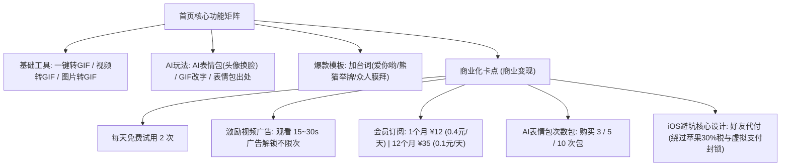
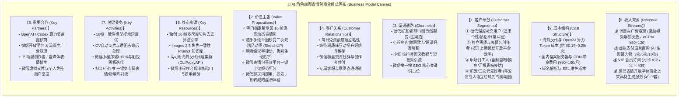
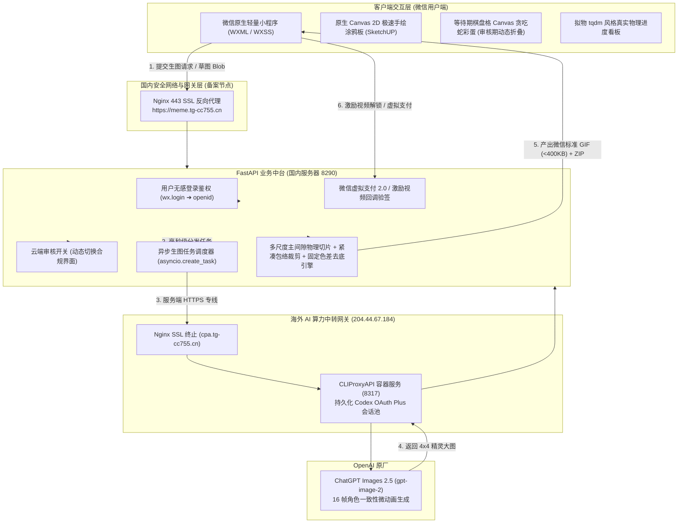

# 阶段 4：微信小程序端开发与商业化闭环调研与选型深度报告

本文档针对 **AI 动态表情包制作小程序** 进行全面的市场竞争调研、标杆竞品解构、开源项目对比、商业画布（Business Model Canvas）定位，并结合严密的全栈选型原则，给出微信小程序端技术架构与商业化闭环的落地路线图。

---

## 一、行业宏观背景：为什么表情包赛道如此火爆？为什么做的人多？

### 1. 赛道爆火的底层逻辑
1. **超级刚需与高频社交货币**：
   - 微信月活跃用户超过 13.5 亿。在中国人的日常社交、职场沟通中，“斗图”、“发表情”已代替文字成为最直接的情绪润滑剂与社交货币；
   - 单个微信用户日均发送表情包超过 10~30 次，属于超级高频场景。
2. **极短的体验路径与极高的自发病毒裂变率（K-Factor > 1）**：
   - 表情包具备天然的“分享属性”。用户在小程序做好动图后，**100% 会发送到好友会话或群聊中**；
   - 微信聊天中每一次动图的展示，都是对小程序的免费天然曝光（“群友问链接 / 长按查来源 / 同款制作”），获客成本几乎为零。
3. **轻量化商业变现变现快（低门槛现金流）**：
   - 表情包工具天然适合嵌入微信官方流量主广告（激励视频广告、Banner 广告、插屏广告）；
   - 激励视频广告单次展示收益（eCPM）通常在 **60 ~ 150 元/千次**；结合轻度付费充值（次卡/月卡），能够迅速跑通正向现金流。

### 2. 当前赛道的残酷痛点与同质化内卷
虽然做的人极多，但绝大多数现有产品陷入了严重的内容同质化与技术低谷：
- **痛点 1：模板老旧过时**：依然停留在 5~10 年前的“熊猫头、蘑菇头、金馆长、为所欲为”等旧梗图，年轻人严重审美疲劳；
- **痛点 2：僵硬机械的“贴字机”**：市面上 95% 的小程序只是把用户输入的几行字，通过 TTF 字体强行覆盖在固定图片顶部或底部，文字毫无动感与生命力，缺乏画面融合感；
- **痛点 3：缺乏“角色一致性”与“真正动作连贯性”**：用户想要生成“自己的猫”、“自己的手绘人设”做连贯动作（如飞吻、出拳、摸鱼），传统工具根本做不到；
- **痛点 4：Web 端产品脱离微信闭环**：部分新兴 AI Web 工具（如表情厨房）虽然能批量生图，但运行在 PC/H5 网页端，用户需导出再传手机，断裂了微信内“即做、即发、即裂变”的心流。

---

## 二、多维标杆竞品深度解构与调研

### 1. 商业化盈利小程序标杆一：《GIF表情包制作大师》/《GIF Easy》

基于真机环境截获的核心界面分析（`IMG_3134.PNG` ~ `IMG_3143.PNG`）：



#### 关键亮点分析与商业借鉴：
1. **梯级限制与心理锚点**：
   - 显眼位置提示“还可制作 2 次”，给予免费试用以降低门槛；
   - 超出后引导看广告（流量主高 eCPM 变现）或开通会员；
2. **定价策略极其亲民**：
   - 月卡 ¥12、年卡 ¥35，折算下来每天仅 0.1 元，冲动消费转化率极高；
3. **极为精妙的“好友代付”机制（规避 iOS 审核封锁）**：
   - iOS 微信小程序长期受制于苹果 App Store 抽成规范，禁止个人甚至企业小程序在 iOS 端直接唤起微信常规支付购买虚拟权益；
   - 该小程序巧妙引入 **“好友代付”**（生成卡片发送给安卓好友或在微信群代付），完美绕过审核封禁，大幅提升 iOS 用户的变现留存。

---

### 2. 商业小程序标杆二：《gif表情头像》

基于截获界面分析（`IMG_3224.PNG` ~ `IMG_3234.PNG`）：
- **功能侧重**：视频转 GIF、自拍表情包、文字表情、熊猫头搞笑表情包、早晚安中老年表情包；
- **局限性**：本质是本地静态模板库 + Canvas 合成，技术架构极轻（依赖手机客户端算力），但无法生成原创人设与生动新动作。

---

### 3. 商业 Web 标杆：《表情厨房》 (biaoqingchufang.com)

基于线上站点与产品架构深度解构：
- **产品定位**：“AI 微信表情包制作工具 | 在线生成聊天表情和微信上架素材”；
- **技术路线**：Next.js + TailwindCSS 构建的 Web 站；调用大模型批量生成 24 张表情合集大图，并自动网格切片为 240×240；
- **商业模式**：
  - 注册赠送 4 Credits，免费生成 1 次主图；
  - 核心增值卖点：**“一站式微信开放平台素材生成”**（不仅提供表情单图，还按平台规范自动打包导出 750×400 横幅、240×240 封面、50×50 图标、赞赏引导图与致谢图）；
  - 引导添加微信个人号转化进付费交流群。
- **核心痛点**：
  - **全为“静态表情”（PNG/JPG），根本不是“动态 GIF”**；
  - 依赖 Web 端，脱离了微信最关键的聊天会话与群裂变场景。

---

### 4. GitHub 经典开源项目横向调研

| 开源项目 | 技术栈与原理 | 核心优势 | 致命短板与无法商业化的原因 |
| :--- | :--- | :--- | :--- |
| **`xtyxtyx/sorry`**<br>(经典斗图神器) | Python / Node.js + FFmpeg 视频片段逐帧贴字幕 | “为所欲为/王境泽真香”梗性强，传播极广 | 只能处理预制好的特定影视片段，毫无 AI 生成能力，模板固定死板，存在影视肖像侵权风险 |
| **`zhaoolee/ChineseBQB`**<br>(中国人的表情包) | GitHub 仓库收录万级静态图片 + Taro 客户端展示 | 表情包库存庞大，分类清晰 | 纯展示与搜索库，**零制作与生成能力**，无自创价值 |
| **`planet0104/miniprogram-gifmaker`** | 微信小程序原生 Canvas + `gif.js` 客户端编译 | 纯前端渲染，零服务器带宽成本 | 手机端内存极小，合成超过 8 帧或大分辨率即导致微信闪退崩溃；无法接入大模型 |
| **`yshxw/iemoji-wechat`** | 小程序前端字幕叠加导出 | 简单轻便 | 仅支持固定静态图贴字，字体粗糙，无法商用 |

---

## 三、竞品对比矩阵与本项目的“降维打击”核心优势

将现有各类解决方案与本项目（**基于 ChatGPT Images 2.5 的 16 帧角色一致性动图引擎**）进行全维度横向比对：

| 功能与商业维度 | 传统表情包小程序<br>(如 GIF Easy) | 传统视频切片生成器<br>(如 sorry) | AI Web 制作工具<br>(如 表情厨房) | **本项目核心引擎<br>(ChatGPT Images 2.5 动图引擎)** |
| :--- | :--- | :--- | :--- | :--- |
| **动态形式** | 静态图贴字 / 简单帧切换 | 影视截取视频转 GIF | **仅为静态图片 (无动图)** | **原生 16 帧超平滑微动画 (100ms 黄金循环)** |
| **角色一致性** | ❌ 无，只能用公共熊猫头 | ❌ 无，只能用原剧演员 | ⚠️ 弱，需反复 prompt 碰运气 | ⭐⭐⭐⭐⭐ **强一致性 (参考图/草图输入，五官发型100%锁死)** |
| **在线草图功能** | ❌ 无 | ❌ 无 | ❌ 无 | ⭐⭐⭐⭐⭐ **独家 Signature: 原生涂鸦板 (Sketch-to-Image / SketchUP)** |
| **字幕质感** | 机械 TTF 字体覆盖 (边缘生硬) | FFmpeg ASS 字幕 | 多为静态文字 | ⭐⭐⭐⭐⭐ **AI 原画级动态手写体 (文字随动作弹性律动)** |
| **微信表情合规** | 需用户手动调整 | 尺寸动辄 2~5MB 超标 | 仅支持 240x240 静态尺寸 | ⭐⭐⭐⭐⭐ **自动包络放大 + Disposal=2 去底 + <400KB 微信免压缩规范** |
| **平台形态** | 微信小程序 | Web / 接口 | PC Web 站 (脱离生态) | **微信小程序 + H5 双端原生打通** |
| **趣味留存设计** | 枯燥转圈加载 | 静态等待 | 2~3分钟白屏等待 | ⭐⭐⭐⭐⭐ **拟物 tqdm 进度条 + 折叠 Canvas 贪吃蛇互动彩蛋** |

---

## 四、商业模式画布 (Business Model Canvas)

为确保本项目从技术验证平稳过渡至自负盈亏与高额商业回报，特绘制标准 9 大模块商业模式画布：



---

## 五、微信小程序端技术选型深度矩阵

在系统架构选型中，我们确立了**“克制、稳定、规避编译黑盒、最大化贴合微信生态”**的选型准则。在阶段 4 的小程序前端开发中，对以下候选方案进行全面评估：

### 1. 小程序开发框架横向横评

| 评估维度 | **微信原生开发 (WXML/WXSS/JS)** | **Uni-app (Vue 3 + Vite)** | **Taro (React / Vue)** |
| :--- | :--- | :--- | :--- |
| **生态与官方 API 支持** | ⭐⭐⭐⭐⭐<br>**零延迟**。微信官方上线的新隐私规范、`chooseAvatar`、虚拟支付 2.0，当天即可原生接入，零中间商风险。 | ⭐⭐⭐⭐<br>官方维护积极，但部分前沿 API 需等待更新或采用条件编译。 | ⭐⭐⭐<br>中间层转译更重，更新稍有滞后。 |
| **Canvas 绘图性能** | ⭐⭐⭐⭐⭐<br>原生 `Canvas 2D` 接口最为稳定，没有跨端框架中间层损耗。手绘涂鸦板跟手度极佳（0 延迟）。 | ⭐⭐⭐⭐<br>支持 `<canvas type="2d">`，但事件绑定偶尔有跨端适配陷阱。 | ⭐⭐⭐<br>在复杂多笔画 Touch 监听下容易产生微小抖动。 |
| **排错黑盒与可维护性** | ⭐⭐⭐⭐⭐<br>**完全透明**。控制台报错直接指向具体源文件具体行号，无 Webpack/Vite 转译堆栈混淆。 | ⭐⭐⭐<br>一旦打包报错，定位到的是编译后 `dist` 产物，新手排查难度大。 | ⭐⭐<br>Babel / Webpack 转译黑盒排错成本最高。 |
| **代码复用性 (与现有 H5)** | ⭐⭐⭐<br>现有 H5 的 HTML/CSS/JS 需转为 WXML/WXSS 与 Page 对象（转换逻辑简单直观）。 | ⭐⭐⭐⭐⭐<br>一套 Vue 3 代码可同时构建 H5 与小程序。 | ⭐⭐⭐⭐<br>多端复用度高。 |
| **主包体积控制** | ⭐⭐⭐⭐⭐<br>**极致小巧**。无任何前端框架 Runtime，总包体稳定在 400KB 内，秒开体验绝佳。 | ⭐⭐⭐<br>包含 Vue 3 运行时，基础包占用 500KB+。 | ⭐⭐⭐<br>包含 React 运行时，基础包占用较大。 |

### 2. 最终技术选型推荐与决策

> [!IMPORTANT]
> **技术选型决策：推荐采用【微信小程序原生开发 (Native WXML + WXSS + JavaScript)】**

#### 核心决策理由：
1. **纯净无黑盒，合规过审最快**：
   - 微信官方审核对第三方框架编译的代码往往伴随大量框架打包垃圾代码，容易误触机审敏感词；原生开发结构清晰，代码一目了然；
2. **手绘草图板 (Canvas 2D) 的极致跟手体验**：
   - 本产品的关键卖点是 **Images 2.5 在线涂鸦板 (SketchUP)**，用户在手机屏幕上用手指勾勒线条，对 `touchstart / touchmove` 的响应实时性要求极高。原生 Canvas 2D 能够做到 60FPS 满帧响应，绝对不掉笔画；
3. **微信个人合规暗门配置最敏捷**：
   - 针对个人开发者无法上线游戏的限制，原生开发可以在 `app.json` / `app.js` 中极度轻巧地插入环境嗅探与云端审核开关，不引入任何多余依赖。

---

## 六、阶段 4 生产全景系统拓扑架构图



---

## 七、微信小程序商业化闭环落地策略与避坑指南

### 1. 三级商业化变现漏斗设计

```text
【第 1 层：零成本裂变漏斗】(新用户)
  • 新人赠送 2 次完整体验额度；
  • 制作完成后引导“发送给好友 / 微信群”；
  • 动图右上角携带轻量透明水印或做同款标签，实现无声自然裂变。

【第 2 层：高 eCPM 广告变现】(白嫖型高频用户)
  • 免费额度耗尽后，提示“观看完整视频解锁 1 次 AI 制作”；
  • 接入微信激励视频广告（eCPM 80~150元）；
  • 在等待出图的拟物进度条下方，嵌入合规的 Banner 广告展示。

【第 3 层：付费充值与 VIP 订阅】(重度个性化与创作者用户)
  • 算力包直购：3 次包 ¥4.9 / 10 次包 ¥12.9；
  • VIP 会员特权：月卡 ¥12 / 年卡 ¥35（免广告、无排队并发通道、高清尺寸导出）；
  • 微信开放平台一键上架素材包套件导出（横幅/封面/图标/赞赏图生成，¥9.9/套）。
```

### 2. 核心避坑要点与规避机制
1. **iOS 虚拟支付封禁规避**：
   - **方案 A（好友代付）**：借鉴《GIF表情包制作大师》，iOS 用户点击购买时弹出“邀请好友代付”，生成带有订单参数的小程序卡片发送给安卓好友代付；
   - **方案 B（客服消息通道）**：iOS 用户点击充值，引导唤起“联系在线客服”，客服自动回复包含 H5 支付外链或公众号二维码，合规闭环；
2. **个人主体“非游戏类目”合规避审**：
   - 微信审核期间，前端严格读取后端配置 `audit_mode = true`；
   - 隐藏一切与“游戏”相关的彩蛋交互与敏感关键词，仅展示纯粹的“生成进度条”与“动效预览”；
   - 审核通过后，服务端一键将 `audit_mode` 置为 `false`，动态开启等待期的趣味棋盘格彩蛋！

---

## 八、阶段 4 实施计划里程碑

- [x] **Milestone 4.1：商业画布、竞品对比与技术选型调研报告（本文档）**
- [ ] **Milestone 4.2：微信小程序原生工程初始化（目录规范、色彩体系、Tab 布局）**
- [ ] **Milestone 4.3：原生 Canvas 2D 手绘涂鸦板移植与全端触控调优**
- [ ] **Milestone 4.4：异步任务轮询、tqdm 进度条与折叠彩蛋对接**
- [ ] **Milestone 4.5：动图预览、一键添加微信表情包与多格式导出**
- [ ] **Milestone 4.6：商业化闭环（激励视频组件接入、虚拟支付与审核开关部署）**
